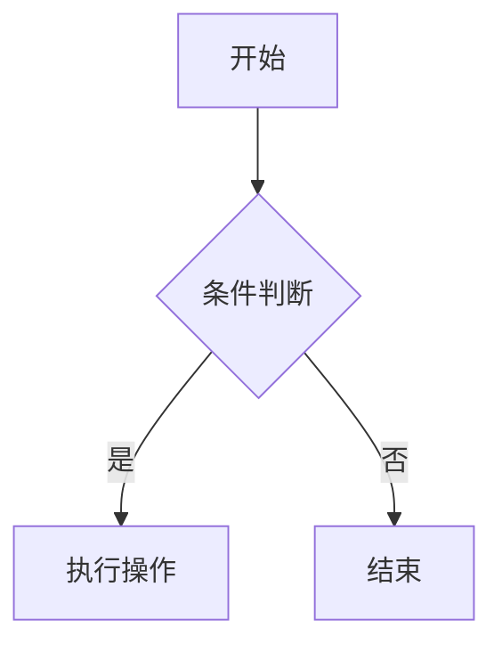
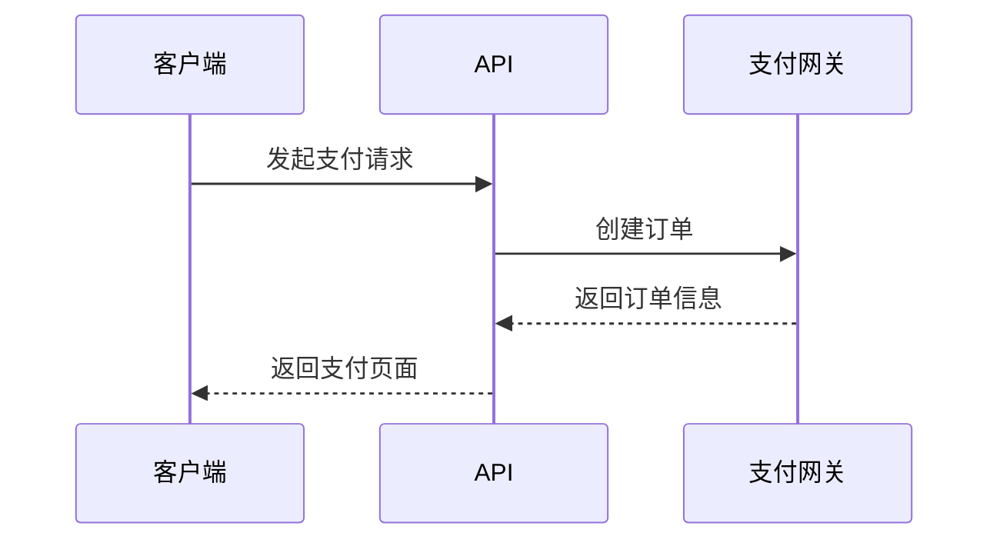
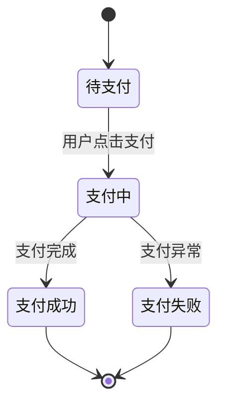

# 文档内容规范指南

本指南帮助你编写高质量的 Onerway 文档内容。好的文档能够让读者快速找到答案，轻松理解概念。

> 参考资料：[What makes documentation good - OpenAI Cookbook](https://github.com/openai/openai-cookbook/blob/main/articles/what_makes_documentation_good.md)

## 一、让文档易于浏览

读者很少从头到尾线性阅读，他们会跳跃浏览，寻找能解决问题的部分。

### 1.1 合理组织内容结构

**使用清晰的章节标题**
- 标题是路标，帮助读者判断是否需要深入阅读
- 优先使用信息丰富的句子而非抽象名词
  - ❌ 差：`结果`
  - ✅ 好：`使用 Webhook 可实时接收支付状态`

**包含目录（TOC）**
- 帮助读者快速定位信息
- 让读者快速了解文档覆盖内容
- 项目已自动生成 TOC，确保标题层级正确（H1-H4）

**保持段落简短**
- 短段落更易浏览
- 重要观点单独成段，避免被埋没

### 1.2 优化段落和句子

**段落首句要能独立理解**
- 读者浏览时会重点看每段第一句
- 首句应该能脱离上下文独立理解
  - ❌ 差：`基于此，让我们讨论更快的方式`
  - ✅ 好：`Webhook 可以实时推送支付状态变更`

**主题词放在句首**
- 让读者只需读前几个字就知道段落主题
  - ❌ 差：`支付状态可以通过 Webhook 实时获取`
  - ✅ 好：`Webhook 可以实时获取支付状态`

**重要信息前置**
- 将最重要的信息放在文档和章节顶部
- 不要铺垫太长才进入重点
- 先说结果，再说过程

### 1.3 善用格式化

**使用列表和表格**
```markdown
<!-- 好的示例 -->
支付方式包括：
- 信用卡支付
- 银行转账
- 数字钱包

| 环境 | API 地址 |
|------|---------|
| 沙盒 | https://sandbox-api.onerway.com |
| 生产 | https://api.onerway.com |
```

**加粗重要文本**
- 帮助读者快速找到关键信息
- **API 密钥**、**重要提示**、**必需参数** 等

## 二、写好每个句子

### 2.1 简洁清晰

**保持句子简单**
- 拆分长句为短句
- 删除不必要的词汇和短语
- 多用祈使语气：`创建支付订单` 而非 `你需要创建支付订单`

**避免歧义**
- 确保句子只有一种解析方式
  - ❌ 差：`用句子标题章节` （Title 可能是名词或动词）
  - ✅ 好：`将章节标题写成完整句子`

**避免左分支句子**
- 不要让读者记忆太多信息才能理解句意
  - ❌ 差：`你需要 API 密钥、商户 ID、回调 URL 和签名密钥来创建支付`
  - ✅ 好：`创建支付需要以下参数：API 密钥、商户 ID、回调 URL 和签名密钥`

### 2.2 避免指代不清

**减少代词使用**
- 尤其是跨句子的 `这`、`那`、`它`
  - ❌ 差：`基于前面的讨论，现在让我们讨论函数调用`
  - ✅ 好：`基于消息格式，现在让我们讨论函数调用`

### 2.3 保持一致性

**统一术语和格式**
- 如果使用 `API 密钥`，不要混用 `API Key` 或 `密钥`
- 如果使用 `沙盒环境`，不要混用 `测试环境` 或 `sandbox`
- 保持代码示例的格式一致（缩进、命名风格等）

**不要假设读者的想法**
- ❌ 差：`你现在可能想了解如何调用 API`
- ❌ 差：`接下来，你需要学习创建支付`
- ✅ 好：`要调用 API，请...`
- ✅ 好：`创建支付的步骤如下...`

## 三、帮助所有读者

读者的知识水平、语言能力和耐心各不相同。尽量让文档对所有人都有帮助。

### 3.1 使用简单语言

**用简单的方式解释**
- 许多读者英语不是母语（中文文档同样要简洁）
- 许多读者可能对技术术语不熟悉
- 宁可解释得简单些，但不要过度简化

**避免缩写**
- 首次出现时写全称
  - ❌ `使用 ACH 支付`
  - ✅ `使用 ACH（Automated Clearing House，自动清算所）支付`

### 3.2 提供完整解决方案

**预见并解决潜在问题**
- 即使 95% 的读者知道如何操作，也值得主动解释
- 对专家没有成本（可以快速跳过）
- 对新手有巨大价值（避免卡住或放弃）

**示例：环境变量设置**
```markdown
## 配置 API 密钥

1. 在 Dashboard 中获取你的 API 密钥
2. 设置环境变量：

::code-group
```bash [macOS/Linux]
export ONERWAY_API_KEY="your_api_key_here"
```

```powershell [Windows]
$env:ONERWAY_API_KEY="your_api_key_here"
```
::
```

### 3.3 使用准确的术语

**优先使用清晰的术语**
- 为新手优化，而不是为我们自己
  - 使用 `最大令牌限制` 而非 `上下文窗口`
  - 使用 `支付金额` 而非 `交易价值`
  - 使用 `支付状态` 而非 `订单状态`（在支付文档中）

### 3.4 优化代码示例

**保持示例通用且可导出**
- 最小化依赖，不要求安装额外库
- 示例应该自包含，避免跨页面引用
- 提供多语言示例（适用于 API 文档）

```markdown
<!-- 好的示例结构 -->
::code-group
```javascript [Node.js]
const onerway = require('onerway');
const payment = await onerway.payments.create({
amount: 1000,
currency: 'USD'
});
```

```python [Python]
import onerway
payment = onerway.Payment.create(
amount=1000,
currency='USD'
)
```

```php [PHP]
$payment = \Onerway\Payment::create([
'amount' => 1000,
'currency' => 'USD'
]);
```
::
```

### 3.5 内容优先级

**优先编写高价值内容**
- 覆盖常见问题的文档价值远高于罕见问题
- 优先级示例：
  1. 如何创建支付订单（高频）
  2. 如何处理支付失败（常见）
  3. 如何优化特殊场景（低频）

**不要教授不良习惯**
- ❌ 永远不要在示例代码中硬编码 API 密钥
- ✅ 始终使用环境变量或配置文件
- ✅ 提供正确的错误处理示例

### 3.6 提供背景信息

**用宽泛的开场介绍主题**
- 帮助读者建立上下文
- 即使是专家也可能欣赏好的介绍

```markdown
<!-- 好的示例 -->
# Webhook 通知

Webhook 是现代 Web 应用中广泛使用的事件通知机制，从支付平台到
聊天应用都在使用。Onerway 通过 Webhook 实时推送支付状态变更，
让你的应用能够及时响应用户的支付行为。

## 工作原理
...
```

## 四、Onerway 项目特定规范

### 4.1 Frontmatter 规范

每个文档页面必须包含正确的 frontmatter：

```yaml
---
title: 页面标题
description: 简短描述（用于 SEO 和摘要）
---
```

### 4.2 多语言一致性

**保持中英文文档结构一致**
- 英文和中文文档应有相同的目录结构
- 标题层级应该对应
- 代码示例保持一致

**翻译而非改写**
- 中文文档应该是英文文档的翻译
- 保持相同的示例和用例
- 专业术语保持一致

### 4.3 使用项目组件

**充分利用自定义组件**

项目提供了丰富的内容组件，合理使用可以提升阅读体验：

```markdown
<!-- 代码示例 -->
::code-group
```bash [cURL]
curl https://api.onerway.com/v1/payments
```

```javascript [Node.js]
const payment = await onerway.payments.list();
```
::

<!-- 链接切换 -->
::link-switch{preset="dashboard"}
::

<!-- 手风琴折叠 -->
::accordion
  ::accordion-item{title="常见问题"}
  这里是答案内容
  ::
::

<!-- 标签页 -->
::tabs
  ::tab-item{label="沙盒环境"}
  沙盒环境配置...
  ::

  ::tab-item{label="生产环境"}
  生产环境配置...
  ::
::

<!-- 提示框 -->
::note
这是一个重要提示
::

::warning
这是一个警告信息
::
```

详见 `app/components/README.md` 了解所有可用组件。

### 4.4 MDC 组件语法

MDC (Markdown Components) 是 Nuxt Content 的组件语法，用于在 Markdown 中使用 Vue 组件。

#### 基本结构

```markdown
::component-name
内容（默认插槽）
::
```

#### 嵌套层级

MDC 使用冒号数量来表示组件的嵌套深度：

| 冒号数量 | 嵌套层级 | 说明 | 示例 |
|---------|---------|------|------|
| `::` | Level 0 | 顶级组件 | `::card` |
| `:::` | Level 1 | 嵌套在 `::` 内 | `:::card-body` |
| `::::` | Level 2 | 嵌套在 `:::` 内 | `::::card-footer` |
| `:::::` | Level 3 | 嵌套在 `::::` 内 | `:::::nested-item` |

**嵌套示例**：

```markdown
::tabs
  :::tab-item{label="选项1"}
  这是选项1的内容
  :::

  :::tab-item{label="选项2"}
  这是选项2的内容
    ::::note
    嵌套的提示框
    ::::
  :::
::
```

**重要规则**：
- 子组件的冒号数量必须比父组件多一个
- 开始标记和结束标记的冒号数量必须相同
- 嵌套层级必须正确对齐，否则会解析错误

#### 属性写法

**内联属性（简单值）**

```markdown
<!-- 字符串 -->
::alert{type="warning" icon="i-heroicons-exclamation"}
内容
::

<!-- 布尔值 -->
::card{elevated=true dismissible=false}
内容
::
```

**YAML 属性块（复杂数据推荐）**

```markdown
::navigation
---
title: 快速链接
items:
  - label: 首页
    icon: i-heroicons-home
    to: /
  - label: 文档
    icon: i-heroicons-book-open
    to: /docs
---
::
```

**数组和对象（内联）**

```markdown
<!-- ⚠️ 必须使用 : 前缀 -->
::dropdown{:items='["选项A","选项B","选项C"]'}
::

::chart{:config='{"responsive":true,"maintainAspectRatio":false}'}
::
```

**规则：**
- 简单值（字符串、布尔）→ 直接写 `key="value"` 或 `key=true`
- 数组/对象 → **必须**加 `:` 前缀：`:key='[...]'` 或 `:key='{...}'`
- 外层用单引号 `'`，内部 JSON 用双引号 `"`
- 复杂结构优先使用 YAML 块

#### 命名插槽

```markdown
::card
#header
标题内容
#body
主体内容
#footer
底部内容
::
```

#### 最佳实践

**✅ 推荐**

```markdown
<!-- 简单属性用内联 -->
::badge{color="green"}NEW::

<!-- 复杂结构用 YAML -->
::prose-tabs
---
variant: pill
items:
  - label: JavaScript
    value: js
  - label: TypeScript
    value: ts
---
:::prose-tabs-item{value="js"}
JS 代码
:::
:::prose-tabs-item{value="ts"}
TS 代码
:::
::
```

**❌ 避免**

```markdown
<!-- ❌ 数组忘记加 : -->
::menu{items='["A","B"]'}
::

<!-- ❌ 复杂数据用内联（难读） -->
::menu{:items='[{"label":"Home","to":"/","children":[{"label":"Sub","to":"/sub"}]}]'}
::
```

#### 快速参考

| 数据类型 | 语法示例 | 前缀 |
|---------|---------|------|
| 字符串 | `type="info"` | 无 |
| 布尔值 | `dismissible=true` | 无 |
| 数组 | `:items='["A","B"]'` | `:` |
| 对象 | `:config='{"key":"val"}'` | `:` |
| 复杂数据 | YAML 块 | N/A |

**核心原则：** 简单用内联，复杂用 YAML，数组/对象加冒号。

### 4.5 链接规范

**内部链接**
- 使用相对路径：`[创建账户](/get-started/set-up-onerway/create-an-account)`
- 不要包含语言前缀（系统自动处理）

**外部链接**
- 自动显示外部链接图标
- 确保链接有效且安全

**API 引用链接**
- 统一链接到 API 参考文档
- 使用一致的格式

### 4.6 代码规范

**API 示例**
- 使用真实但安全的示例数据
- 使用占位符：`sk_test_...` 而非真实密钥
- 包含完整的请求和响应示例

**错误处理**
- 展示正确的错误处理方式
- 说明常见错误及解决方法

### 4.7 图表规范 (Mermaid)

项目支持 Mermaid 图表渲染，可用于绘制流程图、时序图、类图等，帮助读者快速理解复杂的业务逻辑和技术流程。

#### 何时使用图表

**✅ 推荐使用场景**
- 复杂业务流程（支付流程、状态机转换）
- API 调用时序（请求-响应链路、异步通知）
- 数据结构关系（实体关系图、架构设计）
- 决策树和条件分支（多路径业务逻辑）

**❌ 不推荐场景**
- 过于简单的关系（使用列表或表格更清晰）
- 纯装饰性图片（使用实际截图或插图）
- 超过 20 个节点的复杂图表（建议拆分）

#### 支持的图表类型

项目基于 Mermaid 11.x，支持以下图表类型：

- **流程图** (`graph` / `flowchart`)：业务流程、算法步骤
- **时序图** (`sequenceDiagram`)：API 交互、消息传递
- **类图** (`classDiagram`)：数据模型、对象关系
- **状态图** (`stateDiagram`)：状态机、生命周期
- **甘特图** (`gantt`)：项目计划、时间线
- **饼图** (`pie`)：数据占比、统计分布

完整语法参考 [Mermaid 官方文档](https://mermaid.js.org/)。

#### 配置选项

通过代码块元信息传递配置参数：

| 参数 | 类型 | 默认值 | 说明 |
|------|------|--------|------|
| `zoomable` | `"true"` \| `"false"` | `"true"` | 是否启用拖拽缩放和全屏预览 (Alt + 拖拽/滚轮) |
| `dottedBg` | `"true"` \| `"false"` | `"true"` | 是否显示点状网格背景 |

#### 使用示例

**基础流程图**

````markdown

````

**时序图（禁用缩放）**

````markdown

````

**状态图（禁用背景）**

````markdown

````

#### 最佳实践

**保持简洁**
- 控制节点数量在 15 个以内
- 节点文字简短清晰（3-8 个字）
- 避免过深的嵌套层级（建议 ≤ 4 层）

**语言一致性**
- 中文文档使用中文标签和描述
- 英文文档使用英文标签和描述
- 技术术语保持原文（如 API、Webhook）

**视觉层次**
- 关键路径使用粗线或高亮
- 异常分支用虚线或不同颜色
- 重要节点添加图标或强调样式

**拆分复杂图表**
- 超过 20 个节点考虑拆分为多个图表
- 使用多个小图而非一个大图
- 在文字中补充说明图表之间的关系

**交互说明**
- 默认支持 Alt + 拖拽平移和 Alt + 滚轮缩放
- 提供全屏按钮查看大图
- 简单图表可禁用缩放 (`zoomable="false"`)

#### 主题适配

图表会自动适配网站的明暗主题，无需手动配置。主题切换时图表会重新渲染以匹配当前配色。

#### 参考资源

- [ProseMermaid 设计文档](../docs/designs/ProseMermaid.md) - 完整功能说明和技术细节
- [Mermaid 官方文档](https://mermaid.js.org/) - 图表语法参考和示例
- `app/components/README.md` - 组件列表和使用说明

## 五、检查清单

在发布文档前，检查以下项目：

- [ ] 标题清晰且信息丰富
- [ ] 包含正确的 frontmatter
- [ ] 段落简短，易于浏览
- [ ] 重要信息已加粗或突出显示
- [ ] 使用了列表和表格
- [ ] 代码示例完整且可运行
- [ ] 没有硬编码敏感信息
- [ ] 术语使用一致
- [ ] MDC 组件语法正确（数组/对象加 `:` 前缀）
- [ ] 图表简洁易懂，节点数量合理（建议 ≤ 15 个）
- [ ] 图表标签使用正确的语言（中文文档用中文）
- [ ] 复杂图表已拆分或配置了缩放功能
- [ ] 中英文文档结构对应（如果适用）
- [ ] 链接有效且格式正确
- [ ] 语法和拼写正确

## 六、记住核心原则

> **文档写作是一种同理心练习。**

站在读者的角度思考：
- 他们想要解决什么问题？
- 他们的知识水平如何？
- 如何能最快帮到他们？

**在有充分理由时，可以打破这些规则。** 最终目标是帮助读者，而不是遵守规则。

---

  遵循这些指南，让 Onerway 文档成为开发者的得力助手。
