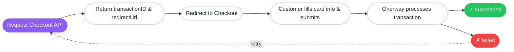

The Onerway APIs are powerful and flexible if you know how to use them. This tour covers key information to help you understand the APIs more deeply:

- The core concepts we use across the APIs
- The path a successful payment takes
- The objects that play a role and how to determine when they're needed
- Common patterns and best practices for using those objects together

Understanding these patterns helps you move beyond the pre-written code in Onerway tutorials. You can combine simple patterns in novel ways and plan for future growth.

## Core concepts

### Transaction lifecycle

Every transaction in Onerway is tracked using a unique transaction ID. Whether it's a payment, refund, or dispute, Onerway generates a transaction ID that follows the payment through its entire lifecycle.

Each checkout session has a 30-minute lifecycle, during which customers can complete their payment. After this window, the session expires and a new session must be created.

You can [query transaction status](#){badge="TODO"} to check the current state of any transaction ID.



### Structured data objects

Onerway uses structured data objects to handle payment information. Each API request follows a clearly defined data structure to ensure accuracy, completeness, and security.

A payment request consists of multiple data objects, each responsible for transmitting specific types of information:

#### Core transaction objects

| Object | Purpose | Key Fields |
|--------|---------|------------|
| `TxnOrderMsg` | Order and merchant context | Return URL, notification URL, product list, customer platform, browser fingerprint data |
| `Products` | Line items for the order | Product name, price, quantity, currency, type (physical/virtual/discount/shipping) |
| `TransactionAddress` | Customer contact and location | Email (required), name, phone, postal code, full address, country (ISO 3166-1 alpha-2) |

#### Payment method objects

| Object | Purpose | Key Fields |
|--------|---------|------------|
| `CardInfo` | Card payment credentials | Cardholder name, card number, expiration month/year, CVV security code |
| `TokenInfo` | Saved payment methods | Token identifier for repeat payments without re-entering card details |
| `LpmsInfo` | Local payment configuration | Payment method type (e.g., WeChat, Alipay), regional wallet settings |

#### Security and subscription objects

| Object | Purpose | Key Fields |
|--------|---------|------------|
| `mpiInfo` | 3D Secure authentication | ECI (Electronic Commerce Indicator), CAVV, XID (v1) or dsTransID (v2) |
| `Subscription` | Recurring billing setup | Billing cycle (frequency type/point), trial period (days/end date), expiration, notification email |

::tip
**Data format**: All nested objects must be serialized as JSON strings before submission. For example, `cardInfo` is passed as a stringified JSON object, not a native object.
::

**Example structure:**

```json
{
  "merchantNo": "800209",
  "merchantTxnId": "txn-12345",
  "orderAmount": "99.99",
  "orderCurrency": "USD",
  "productType": "CARD",
  "subProductType": "DIRECT",
  "txnType": "SALE",
  "txnOrderMsg": "{\"returnUrl\":\"https://example.com/return\",\"notifyUrl\":\"https://example.com/webhook\",\"products\":\"[{...}]\"}",
  "cardInfo": "{\"holderName\":\"John Doe\",\"cardNumber\":\"4111111111111111\",\"month\":\"12\",\"year\":\"25\",\"cvv\":\"123\"}",
  "billingInformation": "{\"email\":\"customer@example.com\",\"country\":\"US\",...}",
  "shippingInformation": "{\"email\":\"customer@example.com\",\"country\":\"US\",...}"
}
```

Regardless of how you integrate Onerway—through direct API calls, SDK integration, or hosted checkout—you need to organize and transmit information according to these predefined structures.

## Integration methods

Onerway offers multiple integration options to meet different business needs. Each option balances user experience, development complexity, and brand presentation differently.

::prose-tabs{:unmount-on-hide="true" sync="integration-method"}

  :::prose-tabs-item{label="Hosted Checkout"}

  Redirect customers to an Onerway-hosted payment page. This option minimizes frontend development work and gets you up and running quickly.

  **How it works:**

  ```mermaid
  sequenceDiagram
      participant Customer
      participant Your Server
      participant Onerway API
      participant Onerway Hosted Page

      Customer->>Your Server: Initiate payment
      Your Server->>Onerway API: Create payment order
      Onerway API-->>Your Server: status: U + redirectUrl
      Your Server-->>Customer: Redirect to redirectUrl
      Customer->>Onerway Hosted Page: Complete payment
      Onerway Hosted Page->>Onerway API: Process payment
      Onerway API-->>Onerway Hosted Page: Payment result
      Onerway Hosted Page-->>Customer: Redirect to returnUrl
  ```

    ::::note
    **PCI compliance**: Onerway handles all sensitive card data, so your integration is automatically PCI compliant without additional certification.
    ::::

  **Best for**: Businesses that want the fastest time to market with minimal development effort.

  :::

  :::prose-tabs-item{label="Embedded Checkout"}

  Embed the payment form directly on your website using the Onerway JavaScript SDK. This option keeps customers on your site throughout the payment flow while maintaining brand consistency.

  **How it works:**

  ```mermaid
  sequenceDiagram
      participant Customer
      participant Your Frontend
      participant Your Server
      participant Onerway API
      participant Onerway SDK

      Customer->>Your Frontend: Initiate payment
      Your Frontend->>Your Server: Request payment setup
      Your Server->>Onerway API: Create Payment Intent
      Onerway API-->>Your Server: status: U + redirectUrl + transactionID
      Your Server-->>Your Frontend: Pass redirectUrl & transactionID
      Your Frontend->>Onerway SDK: Load SDK & render form
      Customer->>Onerway SDK: Enter payment details
      Onerway SDK->>Onerway API: Submit payment (secure)
      Onerway API-->>Onerway SDK: Payment result
      Onerway SDK-->>Your Frontend: Display result
      Your Frontend-->>Customer: Show confirmation
  ```

    ::::note
    **PCI compliance**: Card data is transmitted directly to Onerway, so you remain PCI compliant while keeping customers on your site.
    ::::

  **Best for**: Businesses that want to maintain their visual brand while reducing development complexity.

  :::

  :::prose-tabs-item{label="Direct API"}

  Build a completely custom payment interface by collecting payment information on your frontend and submitting it to Onerway via direct API calls.

  **How it works:**

  ```mermaid
  sequenceDiagram
      participant Customer
      participant Your Frontend
      participant Your Server
      participant Onerway API

      Your Frontend->>Your Frontend: Build custom payment form
      Customer->>Your Frontend: Enter payment details
      Your Frontend->>Your Server: Submit payment data
      Your Server->>Onerway API: Process payment
      Onerway API-->>Your Server: Payment result
      Your Server-->>Your Frontend: Return response
      Your Frontend-->>Customer: Display result
  ```

    ::::warning
    **PCI compliance required**: Because you collect sensitive card data, you must maintain PCI DSS compliance. This option requires more security infrastructure and regular compliance audits.
    ::::

  **Best for**: Businesses that need complete control over the payment experience and have the resources to maintain PCI compliance.

  :::

::

## Choose your integration path

The following table compares the three integration options to help you choose the best fit for your business:

| Feature | Hosted Checkout | Embedded Checkout | Direct API |
|---------|----------------|-------------------|------------|
| **Setup complexity** | Low | Medium | High |
| **PCI compliance** | Onerway handles | Onerway handles | You handle |
| **UI customization** | Limited | Moderate | Full control |
| **Branding** | Shows Onerway | Minimal Onerway | No Onerway branding |
| **User experience** | Redirect required | On-page | Fully customized |
| **Time to integrate** | Fastest | Moderate | Longest |

Each option has trade-offs between development time, customization, and compliance requirements. Choose based on your technical resources and business needs.
