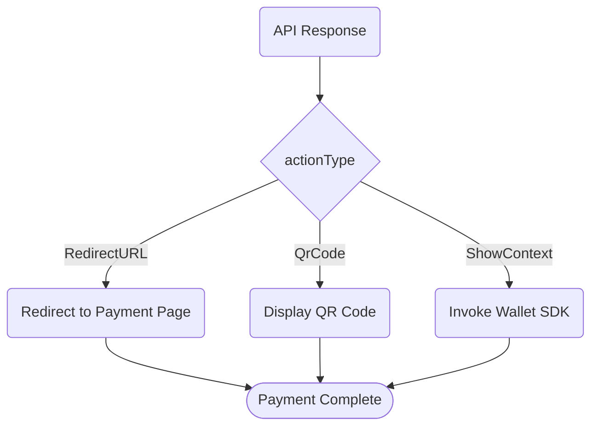

The **`lpmsInfo`** (Local Payment Methods Info) parameter allows you to accept a variety of payment methods through a single API. The `lpmsInfo` object contains the payment method details required to create payments.

With the `lpmsInfo` parameter, you can:

- Accept [140+ local payment methods](#){badge="TODO"} through a unified API
- Control which payment methods appear on your checkout page
- Customize the payment experience for different regions

## Payment status codes

Throughout this guide, payment status is indicated by the following codes:

| Status | Meaning | Description |
|--------|---------|-------------|
| `S` | Success | Payment completed successfully. This is a final status. |
| `F` | Failed | Payment failed or was declined. This is a final status. |
| `R` | Redirect | Redirect required—either a 3DS challenge page or a local payment method page. |
| `P` | Pending | Payment is being processed. Poll the [Order Query API](#){badge="TODO"} until you receive a final status. |

For detailed information on handling each status, see [Payment Status Updates](/get-started/start-building/about-the-apis/payment-status-updates).

## Configure payment methods

Combine `lpmsInfo` with **`productType`** to control which payment methods appear on the checkout page.

To display all enabled payment methods on the Onerway hosted page, set `productType` to `ALL`:

```json
{
  "productType": "ALL"
}
```

To display only a specific payment method, include the `lpmsInfo` parameter with the desired payment type:

```json
{
  "productType": "ALL",
  "lpmsInfo": "{\"lpmsType\":\"Skrill\"}"
}
```

::note
The `lpmsInfo` value is a JSON string that must be escaped when passed as a string parameter. The unescaped format is:

```json
{ "lpmsType": "Skrill" }
```

::

## Supported payment methods

To determine which payment methods to use for specific locales, see the [payment methods guide](#){badge="TODO"}.

The guide includes:

- Available payment methods for different regions
- Detailed descriptions of each payment method's characteristics
- Geographic regions where they're most relevant

To enable additional payment methods, contact your Onerway account manager or [reach out to support](#){badge="TODO"}.

## Customer actions

Some payment methods require your customer to take additional steps to complete the payment. The API response specifies the type of customer action through the **`actionType`** parameter.

| Action Type | Description | Customer Experience |
|-------------|-------------|---------------------|
| `RedirectURL` | Redirect to external page | Redirects to payment provider page |
| `QrCode` | Display QR code | Scans QR code to complete payment |
| `ShowContext` | Invoke wallet app | Launches mobile wallet (for example, WeChat Pay) |

The following diagram illustrates the customer action flow:



### ShowContext details

When `actionType` is `ShowContext`, use the **`codeForm`** and **`presentContext`** values from the response to invoke the appropriate wallet SDK on the customer's device.

::note
Card payments typically don't require additional customer actions, except when [3DS verification](#){badge="TODO"} is triggered. 3DS verification requires further authentication after collecting card details.
::

## Immediate or delayed notification

Some payment methods immediately return payment status when a transaction is attempted (for example, card payments), while others have a delay (for example, Trustly).

### Immediate confirmation

For payment methods with immediate confirmation, you can verify successful payment (status `S`) through:

- Receiving a [webhook notification](#){badge="TODO"}
- Polling the [Order Query API](#){badge="TODO"} after the customer redirects to your `returnUrl`

### Delayed notification

Payment methods with delayed notification can't guarantee payment during the delay period. The status remains `P` (pending) until the payment succeeds or fails. During this time, many businesses hold orders in a *pending* state, waiting to fulfill the order until payment succeeds.

::warning
For payment methods with delayed notification, configure [webhook endpoints](#){badge="TODO"} to receive final payment status notifications.
::

## Single-use or reusable

You can reuse certain payment methods (for example, cards or bank debits) for additional payments without collecting payment details again.

### Reusable payment methods

To reduce the chance of future declines and payment friction (such as [required authentication](#){badge="TODO"}), always set up reusable payment methods for future use. You can set up reusable payment methods:

- [During payment acceptance](#){badge="TODO"} - Save payment details while processing a transaction
- [Without taking a payment](#){badge="TODO"} - Save payment details for later use

::tip
For subscription or recurring payments, always use reusable payment methods to improve customer experience and reduce payment failures.
::

### Single-use payment methods

Single-use payment methods (for example, some types of bank transfers) can't be attached to customers because they're consumed after a payment attempt.

::docs-resources

#title
## See also

#default
  :::docs-resource-item{to="#" title="Payment methods guide" description="Full list of supported payment methods" tags="todo"}
  :::
  :::docs-resource-item{to="#" title="Webhook configuration" description="Set up payment notifications" tags="todo"}
  :::
  :::docs-resource-item{to="#" title="3DS verification" description="Handle card authentication" tags="todo"}
  :::
  :::docs-resource-item{to="#" title="Order Query API reference" description="Check payment status programmatically" tags="todo"}
  :::

::
