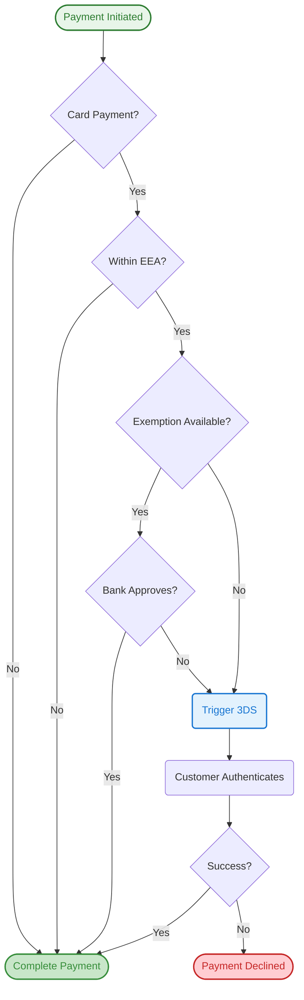

**Applicability:** European Economic Area (EEA), Switzerland, and United Kingdom

In this guide, we'll discuss the European requirement known as Strong Customer Authentication (SCA), introduced by the second Payment Services Directive (PSD2), and the types of payments it covers. We'll also introduce the available exemptions that can be applied on behalf of merchants to create a smooth checkout experience.

## What is Strong Customer Authentication?

Strong Customer Authentication (SCA) is a European regulatory requirement designed to reduce fraud and make online and contactless offline payments more secure. To accept payments and meet SCA requirements, you need to build additional verification into your checkout flow. SCA requires verification of at least two of the following three factors:

| Factor     | Description                  | Examples                        |
| ---------- | ---------------------------- | ------------------------------- |
| Knowledge  | Something the customer knows | Password, PIN code              |
| Possession | Something the customer has   | Mobile phone, hardware token    |
| Inherence  | Something the customer is    | Fingerprint, facial recognition |

For the original text of the SCA requirements, please refer to the [Regulatory Technical Standards](https://eur-lex.europa.eu/legal-content/EN/TXT/?uri=uriserv%3AOJ.L_.2018.069.01.0023.01.ENG&toc=OJ%3AL%3A2018%3A069%3ATOC) (RTS). Banks must decline payments that require SCA but fail to meet its standards.

## When is Strong Customer Authentication Required?

Strong Customer Authentication applies to customer-initiated online payments and contactless offline payments within the UK or European scope. All electronic payments (i.e., card payments and bank transfers) require Strong Customer Authentication (SCA), unless an exemption can be applied or the transaction is considered outside the scope of SCA, such as merchant-initiated transactions (e.g., direct debits).

For online card payments, these requirements apply to transactions where both the merchant and cardholder's bank are located in the [European Economic Area (EEA)](https://www.gov.uk/eu-eea#:~:text=The%20European%20Economic%20Area%20(%20EEA,the%20EU%20's%20single%20market.).).

## How to Authenticate a Card Payment

The most common method for authenticating online card payments is 3DS authentication—an authentication standard supported by most European bank cards. Applying 3DS authentication typically adds an extra verification step after checkout, where the bank prompts the cardholder to provide additional information to complete payment, such as sending a one-time verification code to their phone or performing fingerprint verification in their mobile banking app.

[3DS 2.0 authentication](/payments/payment-operations/compliance-and-security/3d-secure-authentication/3ds-2.0-authentication) is the primary method for authenticating online card payments and meeting SCA requirements.

## Liability for Fraudulent Disputes in 3DS Context

One benefit of applying Strong Customer Authentication (SCA) when multi-factor authentication succeeds is that merchants can avoid liability issues arising from fraudulent disputes.

## How SCA Works in Practice

The following diagram illustrates how SCA and exemptions work together in the payment flow:

## Exemptions to Strong Customer Authentication

::warning
When the customer's bank approves an exemption request, liability shift for fraudulent transactions doesn't apply.
::

Not all payments fall under the multi-factor authentication scope of Strong Customer Authentication (SCA). Some payments are eligible for regulatory exemptions, and others are outside the scope of SCA implementation. When the cardholder's bank requires and accepts an exemption, merchants are responsible for resolving liability issues arising from fraudulent disputes.

During payment processing, payment service providers like Onerway can apply for exemptions. The cardholder's bank then receives this request, evaluates the transaction's risk level, and ultimately decides whether to approve the exemption or still require authentication.

**Benefits of using exemptions:**
- Reduces the number of customer authentication requests
- Decreases checkout friction and improves conversion rates
- Minimizes customer drop-off during payment

Onerway uses machine learning to determine the best exemption approach for each situation, helping you provide the smoothest possible checkout experience for your customers. We've designed payment products that meet SCA requirements and help you maximize the use of exemptions to protect your conversion rate.

For merchants accepting online payments, the most relevant exemptions are:

### Low-Risk Transactions

Payment service providers (such as Onerway) can perform real-time risk analysis (called Transaction Risk Analysis or TRA) to determine whether to apply Strong Customer Authentication (SCA) to a transaction. This exemption is available when the payment provider's overall fraud rate stays below specific thresholds:

- 0.13% to exempt transactions up to €100/£85
- 0.06% to exempt transactions up to €250/£220
- 0.01% to exempt transactions up to €500/£440

These thresholds apply to local equivalent amounts where relevant.

::note
These thresholds illustrate when exemptions can be applied. The actual availability depends on Onerway's real-time fraud rates and cannot be used as guaranteed criteria for individual transactions.
::

### Low-Value Transactions

Transactions under €30 or £25 are considered low-value and can be exempted from Strong Customer Authentication (SCA). However, SCA might still be required by the issuer when either of the following scenarios occurs:

- The cumulative amount of transactions since SCA was last performed exceeds €100/£85
- The cardholder has initiated five transactions since SCA was last performed

The cardholder's bank tracks these exemptions and determines when authentication is required.

Due to these limitations, many payments might not qualify for this exemption. However, Onerway provides support for this exemption service to our customers.

### Recurring Transactions

This exemption applies when a customer makes a series of recurring payments to the same merchant for the same amount. The customer's first payment requires Strong Customer Authentication (SCA), but subsequent charges can be exempted from SCA.

### Merchant-Initiated Transactions (Including Variable Subscriptions)

Payments using saved cards where the customer isn't present in the checkout process (sometimes called off-session, meaning the customer is not actively interacting with your website or app when the payment is processed) might qualify as merchant-initiated transactions (MITs). These payments technically fall outside the scope of Strong Customer Authentication requirements.

In practice, marking a payment as MIT is similar to requesting an exemption. As with other exemptions, it's ultimately up to the bank to decide whether authentication is required for the transaction.

**Requirements for merchant-initiated transactions:**

1. Authenticate the card when it's first saved or during the first payment
2. Obtain customer consent (also called "authorization") to charge their card later

**Common use cases:**

::prose-accordion{multiple}
  :::prose-accordion-item{icon="i-lucide-calendar"}
  #label
  #### Subscription Services

  #content
  A customer subscribes to a monthly software service. The first payment requires 3DS authentication. Subsequent monthly charges are processed as MITs without requiring the customer to authenticate each time.
  :::

  :::prose-accordion-item{icon="i-lucide-shopping-cart"}
  #label
  #### Delayed Capture

  #content
  An e-commerce store authorizes payment when order is placed but captures funds when the item ships (3-5 days later). The capture is processed as MIT.
  :::

  :::prose-accordion-item{icon="i-lucide-repeat"}
  #label
  #### Usage-Based Billing

  #content
  A cloud provider bills customers based on monthly usage. Customers authenticate when adding their card, and monthly invoices are processed as MITs with variable amounts.
  :::
::

Most European banks support this approach if they determine the transaction risk is low.

Onerway's API allows you to authenticate cards when saving them for future use and mark subsequent payments as merchant-initiated transactions. You must use Onerway's latest API to ensure SCA readiness.

## When Exemptions Fail

While exemptions are useful for reducing friction, the cardholder's bank ultimately decides whether to grant an exemption. When an exemption is declined, the bank might return a specific decline code indicating that authentication is required.

**How to handle declined exemptions:**

1. Resubmit the payment with a request for Strong Customer Authentication
2. Prompt the customer to complete authentication
3. For off-session payments, notify the customer to return to your website or app

Onerway automatically triggers the additional authentication flow when a bank requests it for declined exemptions.

::tip
Prepare a backup flow to handle exemption declines, especially for off-session payments where customers need to actively participate.
::

## How Onerway Helps You Meet Strong Customer Authentication Requirements

This regulation has far-reaching impacts on internet commerce businesses in Europe. As Strong Customer Authentication (SCA) rules continue to evolve across European banks, affected businesses that don't comply with these requirements will see impacts on their conversion rates.

In addition to supporting authentication methods such as 3DS 2.0 authentication, we believe that successfully handling exemptions is a key element in building a better payment experience. Our payment products can optimize for different regulatory bodies, banks, and card network rules, and apply appropriate exemptions for low-risk payments so that 3DS authentication is only triggered when necessary. Our advanced machine learning models can also help you adapt to changes in Strong Customer Authentication (SCA) rules.

## Testing SCA Integration

Before going live, test your SCA integration thoroughly to ensure it handles all scenarios correctly.

**Key testing scenarios:**
- Successful authentication flow
- Failed authentication handling
- Exemption approval and processing
- Exemption decline and retry flow
- Off-session payment authentication

Refer to our [3DS Testing Guide](#){badge="TODO"} for detailed test card numbers and step-by-step testing procedures.

## SCA Scope and Exemptions

### Quick Reference

| Payment Type                            | SCA Required? | Notes                              |
| --------------------------------------- | ------------- | ---------------------------------- |
| Customer-initiated, both parties in EEA | ✅ Yes         | Unless exemption granted           |
| Merchant-initiated (MIT)                | ❌ No          | Must authenticate card when saving |
| Recurring (fixed amount)                | ⚠️ First only  | Subsequent payments exempt         |
| Low-value (< €30/£25)                   | ⚠️ Maybe       | Subject to cumulative limits       |
| Low-risk (via TRA)                      | ⚠️ Maybe       | Based on fraud thresholds          |
| One party outside EEA                   | ❌ No          | Outside SCA scope                  |

### Payments Requiring SCA

SCA applies to the following scenarios:
- Customer-initiated online card payments
- Both merchant and cardholder banks are located in the EEA
- First payment in a recurring series

### Payments Eligible for Exemptions

The following payments might qualify for exemptions:
- Low-risk transactions (based on TRA thresholds)
- Low-value transactions (under €30/£25, subject to cumulative limits)
- Subsequent payments in recurring series
- Merchant-initiated off-session payments

### Payments Outside SCA Scope

SCA doesn't apply to:
- Payments where either party is outside the EEA
- Merchant-initiated transactions (e.g., direct debits)
- Payments successfully granted valid exemptions

::tip
Onerway automatically evaluates each payment and requests applicable exemptions to optimize your checkout experience while maintaining compliance.
::

::docs-resources
  :::docs-resource-item{to="/payments/payment-operations/compliance-and-security/3d-secure-authentication/3ds-2.0-authentication" icon="i-lucide-shield-check" tags="Authentication"}
  Learn About 3DS 2.0 Authentication
  :::
  :::docs-resource-item{to="/developer-resources/authenticate-with-3d-secure" icon="i-lucide-book-open" tags="Integration"}
  How to Integrate 3D Secure
  :::
  :::docs-resource-item{to="/payments/payment-operations/compliance-and-security/3d-secure-authentication" icon="i-lucide-lock" tags="Compliance"}
  3D Secure Overview and Requirements
  :::
::
