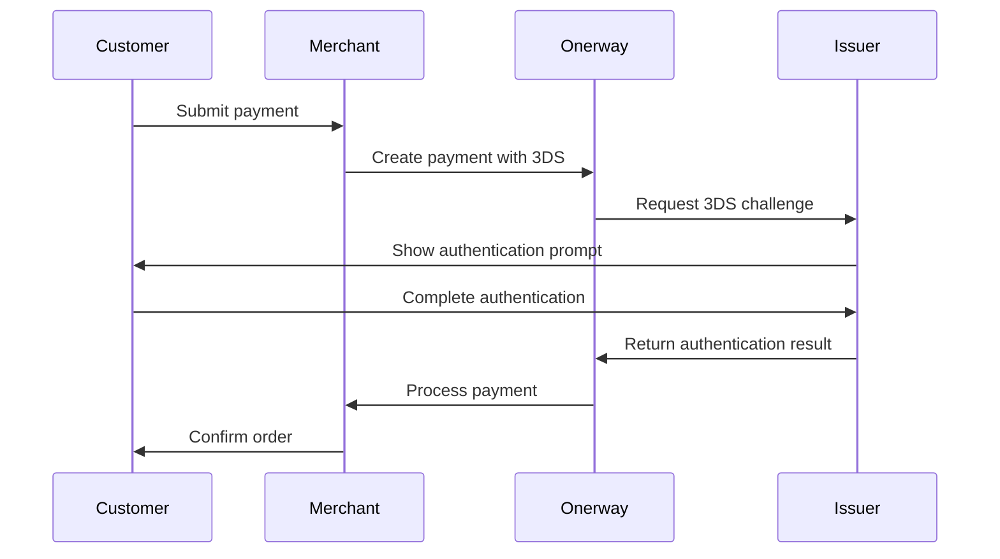

:prose-annotation[3D Secure]{annotation="3D Secure (3DS) provides an additional layer of authentication for credit card transactions that protects businesses from liability for fraudulent card payments."} (**3DS**) is an authentication protocol that adds an additional security layer to card transactions. 3DS verifies that the person making a purchase is the legitimate cardholder. This helps protect both your business and your customers from fraudulent activity.

When 3DS is activated, the issuing bank might request cardholders authenticate through a familiar security prompt. Common authentication methods include:
- Password or PIN entry
- One-time code sent to mobile device
- Biometric verification (fingerprint or face recognition)

Customers may recognize the authentication flow through card network branding such as **Visa Secure**, **Mastercard Identity Check**, or **American Express SafeKey**.

## Regional Requirements

The :prose-annotation[Strong Customer Authentication]{annotation="Strong Customer Authentication (SCA) is a regulatory requirement in effect as of September 14, 2019, that impacts many European online payments. It requires customers to use two-factor authentication like 3D Secure to verify their purchase."} (**SCA**) regulation requires 3DS in certain regions. Understanding these requirements helps you implement compliant payment flows.

| Region                       | Regulation      | 3DS Required  | Status                        |
| ---------------------------- | --------------- | ------------- | ----------------------------- |
| EEA (European Economic Area) | PSD2 / SCA      | ✅ Yes         | Required since September 2019 |
| United Kingdom               | Similar to PSD2 | ✅ Yes         | Required (post-Brexit)        |
| India                        | RBI Guidelines  | ✅ Yes         | Mandatory for card payments   |
| Japan                        | JFSA            | ✅ Yes         | Phased implementation         |
| Australia                    | -               | ⚠️ Recommended | Optional but encouraged       |
| United States                | -               | ❌ Optional    | Fraud prevention tool         |

::note
3DS is **required** for card payments in the EEA, UK, India, and Japan. Failure to implement 3DS may result in declined transactions in these regions.
::

::tip
Enable 3DS even in optional regions to reduce fraud and build customer trust. You can use exemptions to minimize friction for low-risk transactions.
::

## How It Works

## Choose Your Integration

::docs-page-grid{class="py-4 sm:py-8"}
  :::u-page-card
  ---
  title: Authenticate with 3D Secure natively
  description: Add real-time 3D Secure authentication to your payment flow with Onerway's native integration.
  to: /#
  badge: TODO
  spotlight: true
  spotlightColor: primary
  ---
  :::
  
  :::u-page-card
  ---
  title: SCA Exemptions
  description: Use SCA exemptions and Data Only to reduce cardholder friction on eligible transactions.
  to: /#
  badge: TODO
  spotlight: true
  spotlightColor: primary
  ---
  :::
  
  :::u-page-card
  ---
  title: Standalone 3D Secure
  description: Run 3D Secure on Onerway while processing the subsequent payment on a third-party gateway.
  to: /#
  badge: TODO
  spotlight: true
  spotlightColor: primary
  ---
  :::
  
  :::u-page-card
  ---
  title: Import 3D Secure results
  description: Process payments when 3D Secure (3DS) runs outside of Onerway.
  to: /#
  badge: TODO
  spotlight: true
  spotlightColor: primary
  ---
  :::
  
  :::u-page-card
  ---
  title: Payment analytics
  description: Learn how 3D Secure affects your payment success rate in the Dashboard.
  to: /#
  badge: TODO
  spotlight: true
  spotlightColor: primary
  ---
  :::
::
