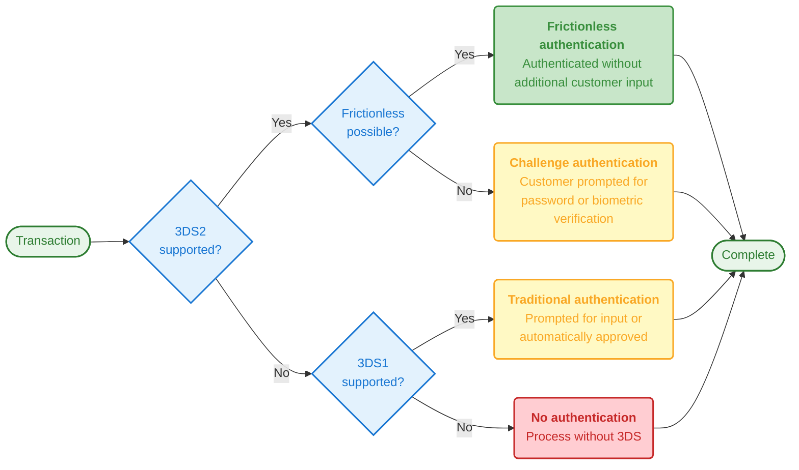

3DS 2.0 authentication (also known as EMV 3-D Secure) is a security protocol designed to reduce fraud and enhance online payment security. It introduces **frictionless authentication** that significantly improves the checkout experience while maintaining strong security standards.

This guide covers how 3DS 2.0 works, its advantages over 3DS 1.0, and its role in meeting Strong Customer Authentication (SCA) requirements—a European regulation requiring additional verification for online payments to reduce fraud.

## Overview

**Key Points:**
- Reduces fraud and enhances online payment security
- Introduces frictionless authentication for better checkout experience
- Primary method for meeting European SCA requirements
- Supported by Onerway's Payment API, JS SDK, and Checkout

The 3DS authentication standard, better known by its brand names such as Visa Secure, Mastercard Identity Check, or American Express SafeKey, aims to reduce fraud and enhance the security of online payments.

Compared to 3DS 1.0, **3DS 2.0 introduces frictionless authentication**, which significantly optimizes the shopping experience. It is the primary card authentication method for meeting European [Strong Customer Authentication](#){badge="TODO"} (SCA) regulations and is a key mechanism for merchants to apply for [SCA exemptions](#){badge="TODO"}.

Onerway's [Payment API](https://docs.onerway.com/apis/en/v0.6/api-card){badge="API v0.6"}, [JS SDK](https://docs.onerway.com/apis/en/v0.6/sdk-integration){badge="SDK v0.6"}, and [Onerway Checkout](https://docs.onerway.com/apis/en/v0.6/checkout){badge="v0.6"} all support 3DS 2.0 authentication.

## Brief History of 3DS 1.0 Authentication

Although some markets have adopted additional security measures, such as [Address Verification System](#){badge="TODO"} (AVS) or [CVC verification](#){badge="TODO"}, card payments still face relatively high fraud risks. It is precisely because of this risk that customers have the right to [dispute](#){badge="TODO"} fraudulent payments made with their cards.

To address this challenge, card networks introduced the first version of 3DS authentication in 2001. If you shop online frequently, you may be familiar with the following 3DS authentication process: after you enter your card information and confirm payment, the system redirects you to another page where you need to enter a verification code or password provided by the issuing bank to confirm the transaction. Since the authentication page typically displays the card network's branding, most customers are more familiar with 3DS authentication brand names such as Visa Secure, Mastercard Identity Check, or American Express SafeKey.

**Benefits of 3DS 1.0:**

For merchants, the benefits of 3DS authentication are clear: **by requiring customers to provide additional information, you can add a layer of fraud protection** to ensure you only receive card payments from genuine customers. Additionally, payment authentication using 3DS can [shift liability](#){badge="TODO"}, transferring the responsibility for fraud-related chargebacks from merchants to issuing banks. This extra security measure is why large transactions (such as airline ticket purchases) typically require 3DS authentication.

**Drawbacks:**

Unfortunately, using 3DS 1.0 authentication also has some drawbacks: it adds an extra payment step, creating friction in the checkout process that sometimes causes customers to abandon their purchase. Moreover, many banks still require cardholders to create and remember their own static passwords to complete 3DS authentication. Such passwords are easily forgotten, further increasing the likelihood of customers abandoning their purchase.

## What's New in 3DS 2.0 Authentication

EMVCo, an organization composed of six major card networks, launched the new version of 3DS authentication. **3DS 2.0 aims to overcome the shortcomings of 3DS 1.0** by introducing less intrusive authentication and a better user experience.

### Frictionless Authentication

With 3DS 2.0, **merchants can securely share more transaction data** with issuing banks. This information includes not only payment details (such as shipping address) but also contextual data (such as customer device ID or previous transaction history).

The cardholder's bank can use this information to assess the transaction's risk level and choose an appropriate response:

- **Frictionless authentication**: If the bank determines the data is sufficient to confirm that the genuine cardholder is making the purchase, the transaction completes without requiring additional customer input.
- **Challenge flow**: If the bank determines that more evidence is needed, the customer must provide additional verification.

While 3DS 1.0 already supported a certain degree of risk-based authentication, **3DS 2.0 allows for sharing more data**, improving transaction approval rates without requiring customers to provide additional information.

| Feature                    | 3DS 1.0                        | 3DS 2.0                                    |
| -------------------------- | ------------------------------ | ------------------------------------------ |
| **Authentication Flow**    | Always requires customer input | Frictionless possible with risk assessment |
| **Data Shared**            | Limited payment details        | Rich transaction + contextual data         |
| **User Experience**        | Full-page redirect             | In-page popup (browser flow)               |
| **Mobile Support**         | Browser redirect               | Native SDK integration                     |
| **Authentication Methods** | Static password / SMS          | Biometric (fingerprint, face ID)           |
| **Liability Shift**        | ✅ With challenge only          | ✅ Both frictionless & challenge            |

Example flow for authenticating payments using 3D Secure 2, with fallback to 3D Secure 1 authentication:

Even if a transaction proceeds through the frictionless flow, **merchants benefit from the same liability shift advantages** as transactions using the challenge flow.

### Better User Experience

Unlike 3DS 1.0, **3DS 2.0 was born in the smartphone era**, allowing banks to provide more innovative authentication experiences through their mobile applications (also known as "out-of-band authentication"). Now, instead of entering passwords or receiving SMS verification codes, users can easily complete payment authentication using biometric technologies such as fingerprint or facial recognition in mobile apps. We expect more and more banks to adopt 3DS 2.0 to facilitate smoother payment authentication processes.

Another significant improvement in user experience is that **3DS 2.0 integrates the challenge flow directly into web and mobile payment processes**, avoiding full-page redirects. Today, when customers authenticate payments, the 3DS authentication interface appears as a popup module directly within the checkout page (browser flow), providing a seamless and convenient authentication experience.

> *Browser authentication flow with in-page popup*

If you're building an application, you can use mobile SDKs specifically developed for 3DS 2.0 authentication to build "in-app" authentication flows, completely avoiding browser redirects.

> *3DS 1.0 authentication: Mobile authentication flow using browser redirect*

> *3DS 2.0 authentication: Improved mobile authentication flow within the app*

## 3DS 2.0 Authentication and Strong Customer Authentication

If you operate in Europe, the implementation of [Strong Customer Authentication](#){badge="TODO"} (SCA) regulations has made 3DS 2.0 authentication even more important. **Since the regulation requires you to verify more payments within Europe**, and 3DS 2.0 provides a better user experience, it can minimize negative impacts on conversion.

Additionally, the 3DS 2.0 protocol itself allows payment service providers like Onerway to request [SCA exemptions](#){badge="TODO"}, eliminating the need to authenticate low-risk payments. **Payments requiring SCA must go through the challenge flow**, while transactions exempted from this authentication will be completed directly through the frictionless flow. However, it's worth noting that if a payment service provider requests an exemption for a payment that requires SCA and completes the transaction through the frictionless flow, they cannot enjoy the benefits of liability shift.

## When to Use 3DS 2.0 Authentication

**Required Scenarios:**
- Payments within the European Economic Area (EEA) subject to SCA
- High-value transactions (typically > €500)
- Customer's first transaction with your business

**Recommended Scenarios:**
- Transactions from high-risk countries or IP addresses
- Unusual purchase patterns detected by fraud scoring

**Optional Scenarios:**
- Low-risk transactions with [SCA exemption](#){badge="TODO"} eligibility
- Recurring subscription payments (after initial authentication)

::tip
Onerway automatically determines when 3DS authentication is required based on transaction risk and regulatory requirements.
::

::docs-resources
  :::docs-resource-item{to="/developer-resources/authenticate-with-3d-secure" icon="i-lucide-shield-check" tags="Authentication"}
  3DS Authentication Overview
  :::
  :::docs-resource-item{title="Strong Customer Authentication (SCA)" to="/payments/payment-operations/compliance-and-security" icon="i-lucide-lock" tags="SCA"}
  Strong Customer Authentication (SCA)
  :::
  :::docs-resource-item{title="SCA Exemptions" to="#" icon="i-lucide-shield-alert" tags="TODO"}
  SCA Exemptions
  :::
::
