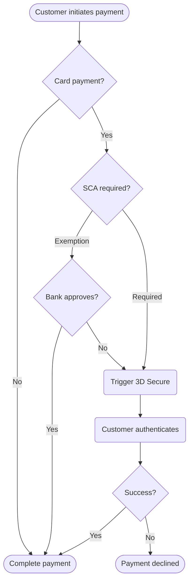

**Strong Customer Authentication （SCA）** is a European regulation that came into effect on September 14, 2019, as part of the **PSD2** directive. It requires changes to how your European customers authenticate online card payments.

To comply with SCA, you must use :prose-annotation[3D Secure]{annotation="3D Secure (3DS) provides an additional layer of authentication for credit card transactions that protects businesses from liability for fraudulent card payments."} for card transactions. Banks may decline payments that don't follow these authentication requirements.

To support SCA:

1. **Determine if SCA impacts your business** - Check the [requirements below](#which-businesses-must-comply-with-sca)
2. **Choose an SCA-ready product** - Review [implementation options](#how-to-implement-sca-with-onerway-products)
3. **Update your integration** - Follow the integration guide to avoid declined payments

## Which businesses must comply with SCA?

Update your Onerway integration to support **SCA** if all of the following apply:

- Based in the :prose-annotation[**European Economic Area**]{annotation="The European Economic Area is a regional single market with free movement of labor, goods, and capital. It encompasses the European Union member states and three additional states that are part of the European Free Trade Association."} **(EEA)**
- Serving customers in the **EEA**
- Accepting card payments (credit or debit)

Banks can require authentication even for low-risk transactions. Although some transactions may qualify for :prose-annotation[SCA exemptions]{annotation="Some transactions that are deemed low risk, based on the volume of fraud rates associated with the payment provider or bank, may be exempt from Europe's Strong Customer Authentication requirements."} based on fraud rates, you should still update your integration to support authentication when requested.

## How to implement SCA with Onerway products

Whether you charge one-time payments or save card information for later use, Onerway provides prebuilt and customizable products to help you meet SCA requirements.

::warning
Integrations that aren't SCA-ready, like those using hosted checkout or legacy JS SDK, might see high rates of declines from banks that enforce SCA.
::

### One-time payments

Accept card payments with the [Payments API](#){badge="TODO"} and [Checkout](#){badge="TODO"}. Both products allow merchants to customize **3D Secure** authentication policies based on their risk management needs.

- **Checkout**: A prebuilt, Onerway-hosted checkout flow that automatically handles SCA requirements. Merchants can customize **3D Secure (3DS)** policies.
- **Payments API**: Allows merchants to customize SCA authentication and build custom payment flows with full control over **3DS** policies.

### Payment authentication flow

### Reusing cards

Save a card for later reuse with the [Payments API](#){badge="TODO"} and the [Setup Intents API](#){badge="TODO"}. You can also use **Checkout** to automatically handle SCA requirements, or use [Billing](#){badge="TODO"} to handle SCA for :prose-annotation[subscriptions]{annotation="Recurring payment plans that charge customers automatically on a regular basis."}.

::note
For subscription payments, Onerway enforces **3D Secure** authentication on the first payment to ensure compliance with SCA requirements. Subsequent recurring payments can use exemptions.
::

## Custom 3D Secure integration

Onerway supports custom **3D Secure (3DS)** integration for businesses with:

- Complete risk control capabilities
- **PCI DSS** compliance qualifications

With custom **3DS**, you can:

- Integrate 3DS services yourself
- Pass authentication results to Onerway via the [API](#){badge="TODO"}
- Complete transactions using your risk assessment

Learn more about [custom 3DS integration](#){badge="TODO"}.

## See also

::docs-resources
  :::docs-resource-item{to="/developer-resources/authenticate-with-3d-secure" icon="i-lucide-shield-check" tags="API,Security"}
  :::
  :::docs-resource-item{to="/payments" icon="i-lucide-credit-card" tags="Payments"}
  :::
::
