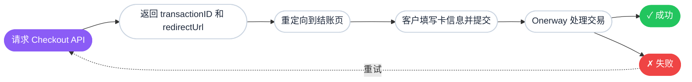

Onerway API 功能强大且灵活，前提是你了解如何使用它们。本指南涵盖以下关键信息，帮助你更深入地理解 API：

- 我们在 API 中使用的核心概念
- 一笔成功支付的完整流程
- 参与其中的对象以及如何判断何时需要它们
- 组合使用这些对象的常见模式和最佳实践

理解这些模式可以帮助你突破 Onerway 教程中的预设代码，以创新的方式组合简单模式，并为未来的业务增长做好规划。

## 核心概念

### 交易生命周期

Onerway 使用唯一的交易 ID 追踪每一笔交易。无论是支付、退款还是争议，Onerway 都会生成一个贯穿整个支付生命周期的交易 ID。

每个结账会话有 30 分钟的有效期，客户需要在此窗口内完成支付。超时后会话将过期，需要创建新的会话。

你可以[查询交易状态](#){badge="TODO"}来检查任意交易 ID 的当前状态。



### 结构化数据对象

Onerway 使用结构化数据对象处理支付信息。每个 API 请求都遵循明确定义的数据结构，以确保准确性、完整性和安全性。

一个支付请求由多个数据对象组成，每个对象负责传输特定类型的信息：

#### 核心交易对象

以下对象处理主要的交易数据：

| 对象 | 用途 | 关键字段 |
|-----|------|---------|
| `TxnOrderMsg` | 订单和商户上下文 | 返回 URL、通知 URL、商品列表、客户平台、浏览器指纹数据 |
| `Products` | 订单行项目 | 商品名称、价格、数量、币种、类型（实物/虚拟/折扣/运费） |
| `TransactionAddress` | 客户联系方式和地址 | 邮箱（必填）、姓名、电话、邮编、完整地址、国家（ISO 3166-1 alpha-2） |

#### 支付方式对象

以下对象处理支付凭证信息：

| 对象 | 用途 | 关键字段 |
|-----|------|---------|
| `CardInfo` | 银行卡支付凭证 | 持卡人姓名、卡号、有效期月/年、CVV 安全码 |
| `TokenInfo` | 已保存的支付方式 | 用于重复支付的 Token 标识，无需重新输入卡信息 |
| `LpmsInfo` | 本地支付配置 | 支付方式类型（如微信、支付宝）、区域钱包设置 |

#### 安全和订阅对象

以下对象处理安全认证和周期性计费：

| 对象 | 用途 | 关键字段 |
|-----|------|---------|
| `mpiInfo` | 3D Secure 认证 | ECI（电子商务指示符）、CAVV、XID（v1）或 dsTransID（v2） |
| `Subscription` | 周期性计费设置 | 计费周期（频率类型/时间点）、试用期（天数/结束日期）、过期时间、通知邮箱 |

::tip
**数据格式**：所有嵌套对象在提交前必须序列化为 JSON 字符串。例如，`cardInfo` 需要作为字符串化的 JSON 对象传递，而非原生对象。
::

**示例结构：**

```json
{
  "merchantNo": "800209",
  "merchantTxnId": "txn-12345",
  "orderAmount": "99.99",
  "orderCurrency": "USD",
  "productType": "CARD",
  "subProductType": "DIRECT",
  "txnType": "SALE",
  "txnOrderMsg": "{\"returnUrl\":\"https://example.com/return\",\"notifyUrl\":\"https://example.com/webhook\",\"products\":\"[{...}]\"}",
  "cardInfo": "{\"holderName\":\"John Doe\",\"cardNumber\":\"4111111111111111\",\"month\":\"12\",\"year\":\"25\",\"cvv\":\"123\"}",
  "billingInformation": "{\"email\":\"customer@example.com\",\"country\":\"US\",...}",
  "shippingInformation": "{\"email\":\"customer@example.com\",\"country\":\"US\",...}"
}
```

无论你通过直接 API 调用、SDK 集成还是托管结账页来接入 Onerway，都需要按照这些预定义的结构来组织和传输信息。

## 集成方式

Onerway 提供多种集成选项以满足不同的业务需求。每种选项在用户体验、开发复杂度和品牌展示之间有不同的平衡。

::prose-tabs{:unmount-on-hide="true" sync="integration-method"}

  :::prose-tabs-item{label="托管结账页"}

  将客户重定向到 Onerway 托管的支付页面。此选项可最大限度减少前端开发工作，让你快速启动运行。

  **工作原理：**

  ```mermaid
  sequenceDiagram
      participant 客户
      participant 你的服务器
      participant Onerway API
      participant Onerway 托管页面

      客户->>你的服务器: 发起支付
      你的服务器->>Onerway API: 创建支付订单
      Onerway API-->>你的服务器: status: U + redirectUrl
      你的服务器-->>客户: 重定向到 redirectUrl
      客户->>Onerway 托管页面: 完成支付
      Onerway 托管页面->>Onerway API: 处理支付
      Onerway API-->>Onerway 托管页面: 支付结果
      Onerway 托管页面-->>客户: 重定向到 returnUrl
  ```

    ::::callout{type="info"}
    **PCI 合规**：Onerway 处理所有敏感卡数据，因此你的集成无需额外认证即可自动符合 PCI 合规要求。
    ::::

  **最适合**：希望以最少开发工作量快速上市的企业。

  :::

  :::prose-tabs-item{label="嵌入式结账"}

  使用 Onerway JavaScript SDK 将支付表单直接嵌入到你的网站中。此选项让客户在整个支付流程中都停留在你的网站上，同时保持品牌一致性。

  **工作原理：**

  ```mermaid
  sequenceDiagram
      participant 客户
      participant 你的前端
      participant 你的服务器
      participant Onerway API
      participant Onerway SDK

      客户->>你的前端: 发起支付
      你的前端->>你的服务器: 请求支付设置
      你的服务器->>Onerway API: 创建 Payment Intent
      Onerway API-->>你的服务器: status: U + redirectUrl + transactionID
      你的服务器-->>你的前端: 传递 redirectUrl 和 transactionID
      你的前端->>Onerway SDK: 加载 SDK 并渲染表单
      客户->>Onerway SDK: 输入支付信息
      Onerway SDK->>Onerway API: 提交支付（安全）
      Onerway API-->>Onerway SDK: 支付结果
      Onerway SDK-->>你的前端: 显示结果
      你的前端-->>客户: 展示确认信息
  ```

    ::::callout{type="info"}
    **PCI 合规**：卡数据直接传输到 Onerway，因此你在保持客户在站内的同时仍符合 PCI 合规要求。
    ::::

  **最适合**：希望保持视觉品牌一致性同时降低开发复杂度的企业。

  :::

  :::prose-tabs-item{label="直接 API"}

  通过在前端收集支付信息并通过直接 API 调用提交到 Onerway，构建完全自定义的支付界面。

  **工作原理：**

  ```mermaid
  sequenceDiagram
      participant 客户
      participant 你的前端
      participant 你的服务器
      participant Onerway API

      你的前端->>你的前端: 构建自定义支付表单
      客户->>你的前端: 输入支付信息
      你的前端->>你的服务器: 提交支付数据
      你的服务器->>Onerway API: 处理支付
      Onerway API-->>你的服务器: 支付结果
      你的服务器-->>你的前端: 返回响应
      你的前端-->>客户: 显示结果
  ```

    ::::callout{type="warning"}
    **需要 PCI 合规**：由于你收集敏感卡数据，必须维护 PCI DSS 合规。此选项需要更多安全基础设施和定期合规审计。
    ::::

  **最适合**：需要完全控制支付体验且有资源维护 PCI 合规的企业。

  :::

::

## 选择你的集成路径

下表比较了三种集成选项，帮助你选择最适合业务的方案：

| 特性 | 托管结账页 | 嵌入式结账 | 直接 API |
|-----|----------|----------|---------|
| **设置复杂度** | 低 | 中 | 高 |
| **PCI 合规** | Onerway 处理 | Onerway 处理 | 你自己处理 |
| **UI 自定义** | 有限 | 适中 | 完全控制 |
| **品牌展示** | 显示 Onerway | 极少 Onerway | 无 Onerway 品牌 |
| **用户体验** | 需要重定向 | 页面内完成 | 完全自定义 |
| **集成时间** | 最快 | 适中 | 最长 |

每种选项在开发时间、自定义程度和合规要求之间都有权衡。请根据你的技术资源和业务需求做出选择。
