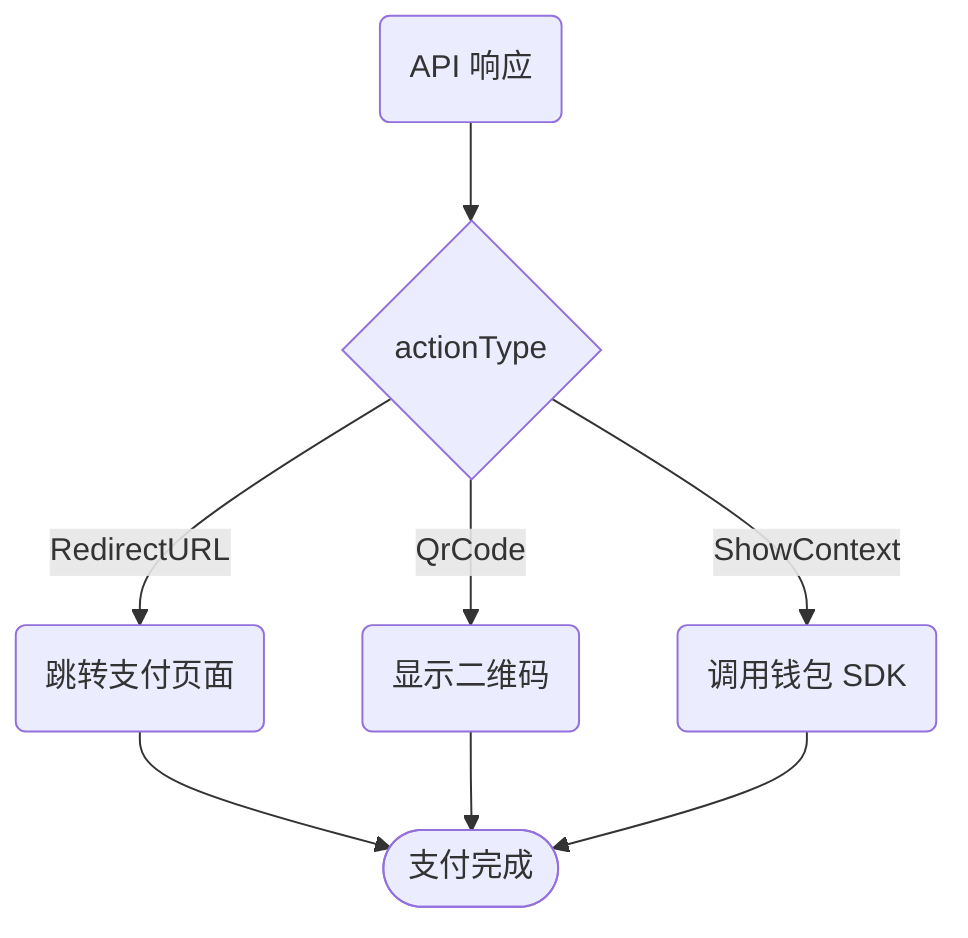

**`lpmsInfo`**（Local Payment Methods Info）参数支持通过统一 API 接受多种支付方式，包含创建支付所需的支付方式详情。

使用 `lpmsInfo` 参数：

- 通过统一 API 接受 [140+ 种本地支付方式](#){badge="TODO"}
- 控制收银台显示的支付方式
- 为不同地区定制支付体验

## 支付状态码

本指南中的支付状态：

| 状态 | 含义 | 说明 |
|------|------|------|
| `S` | 成功 | 支付完成，最终状态 |
| `F` | 失败 | 支付失败或被拒，最终状态 |
| `R` | 跳转 | 需跳转至 3DS 验证页面或本地支付页面 |
| `P` | 待处理 | 处理中，轮询[订单查询 API](#){badge="TODO"} 获取最终状态 |

各状态的处理方式详见[支付状态更新](/get-started/start-building/about-the-apis/payment-status-updates)。

## 配置支付方式

`lpmsInfo` 与 **`productType`** 配合使用，控制收银台显示的支付方式。

显示所有已启用的支付方式，设置 `productType` 为 `ALL`：

```json
{
  "productType": "ALL"
}
```

仅显示特定支付方式，添加 `lpmsInfo` 参数：

```json
{
  "productType": "ALL",
  "lpmsInfo": "{\"lpmsType\":\"Skrill\"}"
}
```

::note
`lpmsInfo` 值为 JSON 字符串，传参时需转义。未转义格式：

```json
{ "lpmsType": "Skrill" }
```

::

## 支持的支付方式

各地区支付方式选择请参阅[支付方式指南](#){badge="TODO"}，包含：

- 各地区可用的支付方式
- 各支付方式的特性说明
- 适用的地理区域

如需启用更多支付方式，请联系 Onerway 客户经理或[联系支持团队](#){badge="TODO"}。

## 客户操作

部分支付方式需要客户完成额外步骤。API 响应通过 **`actionType`** 参数指定操作类型：

| 操作类型 | 说明 | 客户体验 |
|----------|------|----------|
| `RedirectURL` | 跳转外部页面 | 跳转至支付服务商页面 |
| `QrCode` | 显示二维码 | 扫码完成支付 |
| `ShowContext` | 调用钱包 | 唤起移动钱包（如微信支付） |

客户操作流程：



### ShowContext 详情

`actionType` 为 `ShowContext` 时，使用响应中的 **`codeForm`** 和 **`presentContext`** 值调用对应钱包 SDK。

::note
卡支付通常无需额外操作，除非触发 [3DS 验证](#){badge="TODO"}，需在收集卡信息后进行身份验证。
::

## 即时或延迟通知

部分支付方式立即返回状态（如卡支付），部分有延迟（如 Trustly）。

### 即时确认

即时确认的支付方式，通过以下方式验证成功（状态 `S`）：

- 接收 [webhook 通知](#){badge="TODO"}
- 客户跳转回 `returnUrl` 后轮询[订单查询 API](#){badge="TODO"}

### 延迟通知

延迟通知的支付方式在延迟期间无法确认结果，状态为 `P`（待处理）。建议将订单保持*待处理*状态，支付成功后再履行。

::warning
延迟通知的支付方式必须配置 [webhook 端点](#){badge="TODO"}接收最终状态。
::

## 一次性或可复用

部分支付方式（如卡、银行借记）可重复用于后续支付，无需再次授权。

### 可复用支付方式

为减少拒付风险和支付阻力（如[身份验证要求](#){badge="TODO"}），建议将支付方式设为可复用：

- [支付时保存](#){badge="TODO"} - 交易时保存支付详情
- [预先保存](#){badge="TODO"} - 无需支付即可保存

::tip
订阅或循环支付场景，始终使用可复用支付方式，提升体验并降低失败率。
::

### 一次性支付方式

一次性支付方式（如部分银行转账）在支付后即消费，无法绑定客户复用。

::docs-resources

#title
## 另请参阅

#default
  :::docs-resource-item{to="#" title="支付方式指南" description="完整支付方式列表" tags="todo"}
  :::
  :::docs-resource-item{to="#" title="Webhook 配置" description="设置支付通知" tags="todo"}
  :::
  :::docs-resource-item{to="#" title="3DS 验证" description="卡身份验证处理" tags="todo"}
  :::
  :::docs-resource-item{to="#" title="订单查询 API" description="查询支付状态" tags="todo"}
  :::

::
