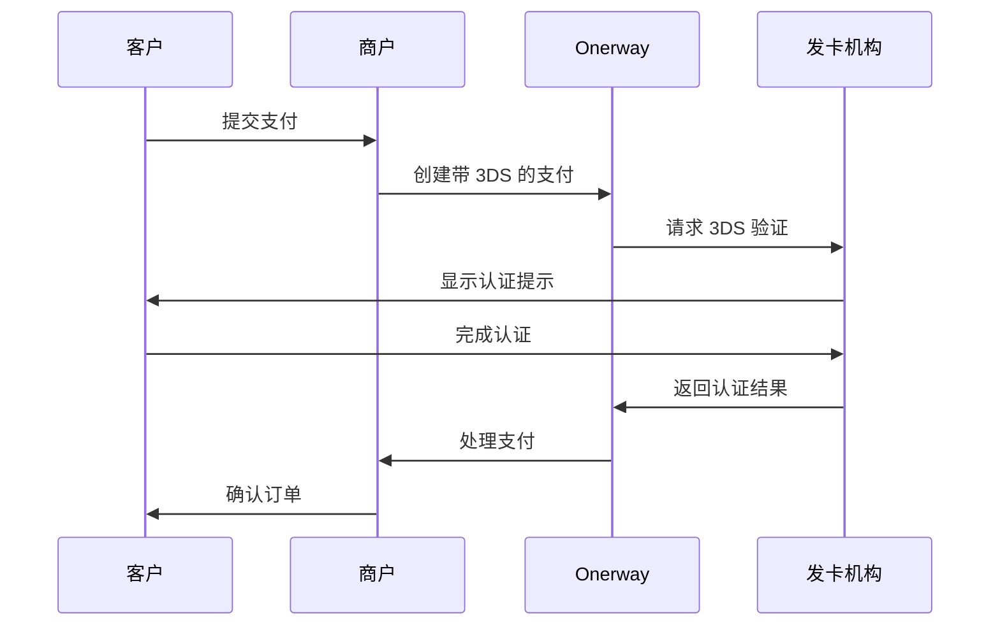

:prose-annotation[3D Secure]{annotation="3D Secure (3DS) 为信用卡交易提供额外的认证层，保护企业免受欺诈性卡支付的责任。"} (**3DS**) 是一种为卡交易增加额外安全层的认证协议。3DS 验证发起购买的人是否为合法持卡人。这有助于保护你的业务和客户免受欺诈活动的侵害。

当 3DS 激活时，发卡机构可能会要求持卡人通过熟悉的安全提示进行认证。常见的认证方式包括：
- 密码或 PIN 码输入
- 发送到移动设备的一次性验证码
- 生物识别验证（指纹或面部识别）

客户可能会通过卡组织品牌识别认证流程，例如 **Visa Secure**、**Mastercard Identity Check** 或 **American Express SafeKey**。

## 区域要求

:prose-annotation[Strong Customer Authentication]{annotation="Strong Customer Authentication (SCA) 是自 2019 年 9 月 14 日起生效的监管要求，影响许多欧洲在线支付。它要求客户使用双因素认证（如 3D Secure）来验证购买。"} (**SCA**) 法规要求在特定区域使用 3DS。了解这些要求有助于你实施合规的支付流程。

| 区域              | 法规           | 3DS 要求 | 状态                  |
| ----------------- | -------------- | -------- | --------------------- |
| EEA（欧洲经济区） | PSD2 / SCA     | ✅ 必需   | 自 2019 年 9 月起必需 |
| 英国              | 类似 PSD2      | ✅ 必需   | 必需（脱欧后）        |
| 印度              | RBI Guidelines | ✅ 必需   | 卡支付强制要求        |
| 日本              | JFSA           | ✅ 必需   | 分阶段实施            |
| 澳大利亚          | -              | ⚠️ 推荐   | 可选但建议启用        |
| 美国              | -              | ❌ 可选   | 欺诈预防工具          |

::note
EEA、英国、印度和日本的卡支付**必须**使用 3DS。未实施 3DS 可能导致这些区域的交易被拒绝。
::

::tip
即使在可选地区也建议启用 3DS，以降低欺诈风险并建立客户信任。对于低风险交易，可以使用豁免来减少摩擦。
::

## 工作原理

## 选择集成方式

::docs-page-grid{class="py-4 sm:py-8"}
  :::u-page-card
  ---
  title: 原生 3D Secure 认证
  description: 使用 Onerway 原生集成为支付流程添加实时 3D Secure 认证。
  to: /#
  badge: TODO
  spotlight: true
  spotlightColor: primary
  ---
  :::
  
  :::u-page-card
  ---
  title: SCA 豁免
  description: 使用 SCA 豁免和仅数据模式降低符合条件交易的持卡人摩擦。
  to: /#
  badge: TODO
  spotlight: true
  spotlightColor: primary
  ---
  :::
  
  :::u-page-card
  ---
  title: 独立 3D Secure
  description: 在 Onerway 上运行 3D Secure，同时在第三方网关处理后续支付。
  to: /#
  badge: TODO
  spotlight: true
  spotlightColor: primary
  ---
  :::
  
  :::u-page-card
  ---
  title: 导入 3D Secure 结果
  description: 处理在 Onerway 外部运行 3D Secure (3DS) 的支付。
  to: /#
  badge: TODO
  spotlight: true
  spotlightColor: primary
  ---
  :::
  
  :::u-page-card
  ---
  title: 支付分析
  description: 了解 3D Secure 如何影响 Dashboard 中的支付成功率。
  to: /#
  badge: TODO
  spotlight: true
  spotlightColor: primary
  ---
  :::
::
