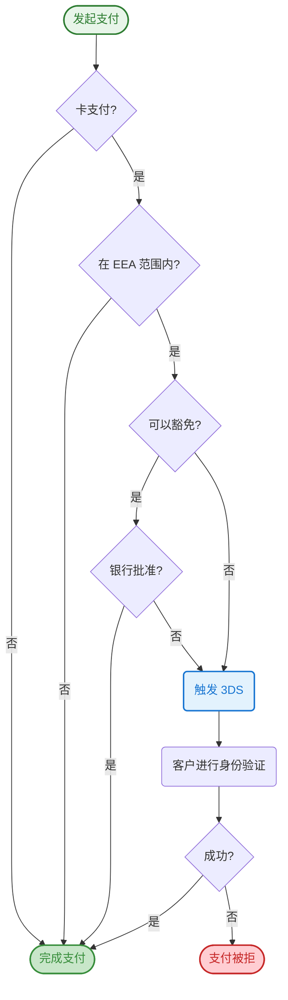

**适用地区：** 欧洲经济区（EEA）、瑞士和英国

本指南将讨论欧洲的强客户认证（SCA）要求，该要求由第二版支付服务指令（PSD2）引入，以及其涵盖的支付类型。我们还将介绍可代表商户申请的豁免类型，以创建流畅的结账体验。

## 什么是强客户认证？

强客户认证（SCA）是欧洲监管要求，旨在减少欺诈并提升在线和非接触式线下支付的安全性。要接受支付并满足 SCA 要求，需要在结账流程中构建额外的验证步骤。SCA 要求验证以下三个因素中的至少两个：

| 因素     | 描述           | 示例           |
| -------- | -------------- | -------------- |
| 知识因素 | 客户知道的信息 | 密码、PIN 码   |
| 持有因素 | 客户持有的物品 | 手机、硬件令牌 |
| 固有因素 | 客户本身的特征 | 指纹、面部识别 |

关于 SCA 要求的原文，请参阅 [监管技术标准](https://eur-lex.europa.eu/legal-content/EN/TXT/?uri=uriserv%3AOJ.L_.2018.069.01.0023.01.ENG&toc=OJ%3AL%3A2018%3A069%3ATOC)（RTS）。对于需要 SCA 但未满足其标准的支付，银行必须拒绝。

## 何时需要强客户认证？

强客户认证适用于英国或欧洲范围内的客户发起的在线支付和非接触式线下支付。所有电子支付（即卡支付和银行转账）都需要强客户认证（SCA），除非可以应用豁免或交易被认为在 SCA 范围之外，例如商户发起的交易（如直接扣款）。

对于在线卡支付，这些要求适用于商户和持卡人银行都位于 [欧洲经济区（EEA）](https://www.gov.uk/eu-eea#:~:text=The%20European%20Economic%20Area%20(%20EEA,the%20EU%27s%20single%20market.).) 的交易。

## 如何验证卡支付

验证在线卡支付的最常见方法是 3DS 认证——一种大多数欧洲银行卡支持的认证标准。应用 3DS 认证通常会在结账后增加一个额外的验证步骤，银行会提示持卡人提供额外信息以完成支付，例如向其手机发送一次性验证码或在其手机银行应用中进行指纹验证。

[3DS 2.0 认证](/payments/payment-operations/compliance-and-security/3d-secure-authentication/3ds-2.0-authentication) 是验证在线卡支付并满足 SCA 要求的主要方法。

## 3DS 场景下欺诈性拒付的责任

当多因素认证成功时，应用强客户认证（SCA）的好处之一是商户可以避免因欺诈性拒付而产生的责任问题。

## SCA 实际运作方式

下图展示了 SCA 和豁免如何在支付流程中协同工作：

## 强客户认证的豁免

::warning
当客户的银行批准豁免请求时，欺诈性交易的责任转移不适用。
::

并非所有支付都属于强客户认证（SCA）的多因素认证范围。某些支付有资格获得监管豁免，另一些则在 SCA 实施范围之外。当持卡人的银行要求并接受豁免时，商户需负责解决欺诈性拒付引起的责任问题。

在支付处理过程中，像 Onerway 这样的支付服务提供商可以申请豁免。持卡人的银行随后会收到此请求，评估交易的风险级别，并最终决定是否批准豁免或仍然要求身份验证。

**使用豁免的好处：**
- 减少客户身份验证请求的数量
- 降低结账摩擦并提高转化率
- 最小化支付过程中的客户流失

Onerway 使用机器学习来确定每种情况下的最佳豁免方法，帮助为客户提供尽可能流畅的结账体验。我们设计的支付产品既满足 SCA 要求，又帮助最大化使用豁免以保护转化率。

对于接受在线支付的商户，最相关的豁免包括：

### 低风险交易

支付服务提供商（如 Onerway）可以执行实时风险分析（称为交易风险分析或 TRA）来确定是否对交易应用强客户认证（SCA）。当支付提供商的整体欺诈率保持在特定阈值以下时，可以使用此豁免：

- 0.13% 可豁免最高 €100/£85 的交易
- 0.06% 可豁免最高 €250/£220 的交易
- 0.01% 可豁免最高 €500/£440 的交易

这些阈值适用于相关的本地等值金额。

::note
这些阈值说明何时可以应用豁免。实际可用性取决于 Onerway 的实时欺诈率，不能用作单笔交易的保证标准。
::

### 低金额交易

低于 €30 或 £25 的交易被视为小额交易，可以豁免强客户认证（SCA）。但是，当出现以下任一情况时，发卡机构可能仍要求 SCA：

- 自上次执行 SCA 以来的累计交易金额超过 €100/£85
- 持卡人自上次执行 SCA 以来已发起五笔交易

持卡人的银行会跟踪这些豁免并决定何时需要身份验证。

由于这些限制，许多支付可能不符合此豁免条件。不过，Onerway 为客户提供此豁免服务的支持。

### 循环交易

此豁免适用于客户向同一商户进行一系列金额相同的循环支付。客户的首次支付需要强客户认证（SCA），但后续扣款可以豁免 SCA。

### 商户发起的交易（包括可变订阅）

使用已保存卡片且客户不在结账流程中的支付（有时称为离线支付，意味着在处理支付时客户未主动与您的网站或应用交互）可能符合商户发起交易（MIT）的条件。这些支付从技术上来说属于强客户认证要求的范围之外。

实际上，将支付标记为 MIT 类似于请求豁免。与其他豁免一样，最终由银行决定交易是否需要身份验证。

**商户发起交易的要求：**

1. 首次保存卡片或首次支付时进行身份验证
2. 获得客户同意（也称为"授权"）以便日后扣款

**常见使用场景：**

::prose-accordion{multiple}
  :::prose-accordion-item{icon="i-lucide-calendar"}
  #label
  #### 订阅服务

  #content
  客户订阅月度软件服务。首次支付需要 3DS 认证。后续的月度扣款作为 MIT 处理，无需客户每次都进行身份验证。
  :::

  :::prose-accordion-item{icon="i-lucide-shopping-cart"}
  #label
  #### 延迟扣款

  #content
  电商店铺在下单时授权支付，但在商品发货时（3-5 天后）扣款。扣款作为 MIT 处理。
  :::

  :::prose-accordion-item{icon="i-lucide-repeat"}
  #label
  #### 基于用量的计费

  #content
  云服务提供商根据月度使用量向客户收费。客户在添加卡片时进行身份验证，月度账单作为可变金额的 MIT 处理。
  :::
::

如果大多数欧洲银行确定交易风险较低，则支持这种方法。

Onerway 的 API 允许在保存卡片以供将来使用时对其进行身份验证，并将后续支付标记为商户发起的交易。必须使用 Onerway 的最新 API 以确保 SCA 合规性。

## 当豁免失败时

虽然豁免对减少摩擦很有用，但持卡人的银行最终决定是否授予豁免。当豁免被拒绝时，银行可能会返回特定的拒绝代码，表明需要身份验证。

**如何处理被拒的豁免：**

1. 使用强客户认证请求重新提交支付
2. 提示客户完成身份验证
3. 对于离线支付，通知客户返回网站或应用

当银行对被拒的豁免请求身份验证时，Onerway 会自动触发额外的身份验证流程。

::tip
准备备用流程来处理豁免拒绝，特别是对于需要客户主动参与的离线支付。
::

## Onerway 如何帮助满足强客户认证要求

该法规对欧洲互联网商务企业产生深远影响。随着强客户认证（SCA）规则在欧洲银行中持续演变，不遵守这些要求的受影响企业将看到其转化率受到影响。

除了支持 3DS 2.0 认证等身份验证方法外，我们认为成功处理豁免是构建更好支付体验的关键要素。我们的支付产品可以针对不同的监管机构、银行和卡网络规则进行优化，并为低风险支付申请适当的豁免，以便仅在必要时触发 3DS 认证。我们的高级机器学习模型还可以帮助您适应强客户认证（SCA）规则的变化。

## 测试 SCA 集成

上线前，彻底测试 SCA 集成以确保正确处理所有场景。

**关键测试场景：**
- 成功的身份验证流程
- 身份验证失败处理
- 豁免批准和处理
- 豁免拒绝和重试流程
- 离线支付身份验证

参考我们的 [3DS 测试指南](#){badge="TODO"} 获取详细的测试卡号和逐步测试流程。

## SCA 范围和豁免

### 快速参考

| 支付类型               | 是否需要 SCA | 备注               |
| ---------------------- | ------------ | ------------------ |
| 客户发起，双方均在 EEA | ✅ 是         | 除非获得豁免       |
| 商户发起（MIT）        | ❌ 否         | 保存卡片时必须认证 |
| 循环（固定金额）       | ⚠️ 仅首次     | 后续支付豁免       |
| 小额（< €30/£25）      | ⚠️ 可能       | 受累计限制约束     |
| 低风险（通过 TRA）     | ⚠️ 可能       | 基于欺诈阈值       |
| 一方在 EEA 之外        | ❌ 否         | 超出 SCA 范围      |

### 需要 SCA 的支付

SCA 适用于以下场景：
- 客户发起的在线卡支付
- 商户和持卡人银行均位于 EEA
- 循环系列中的首次支付

### 有资格获得豁免的支付

以下支付可能有资格获得豁免：
- 低风险交易（基于 TRA 阈值）
- 小额交易（低于 €30/£25，受累计限制约束）
- 循环系列中的后续支付
- 商户发起的离线支付

### SCA 范围之外的支付

SCA 不适用于：
- 任一方在 EEA 之外的支付
- 商户发起的交易（如直接扣款）
- 成功获得有效豁免的支付

::tip
Onerway 会自动评估每笔支付并请求适用的豁免，以在保持合规性的同时优化结账体验。
::

::docs-resources
  :::docs-resource-item{to="/payments/payment-operations/compliance-and-security/3d-secure-authentication/3ds-2.0-authentication" icon="i-lucide-shield-check" tags="身份验证"}
  了解 3DS 2.0 认证
  :::
  :::docs-resource-item{to="/developer-resources/authenticate-with-3d-secure" icon="i-lucide-book-open" tags="集成"}
  如何集成 3D Secure
  :::
  :::docs-resource-item{to="/payments/payment-operations/compliance-and-security/3d-secure-authentication" icon="i-lucide-lock" tags="合规"}
  3D Secure 概述和要求
  :::
::
