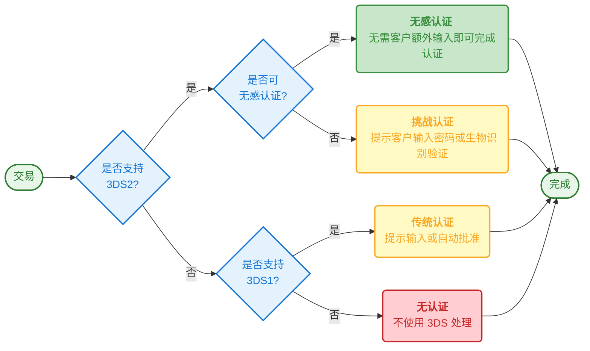

3DS 2.0 认证（也称为 EMV 3-D Secure）是一种旨在减少欺诈并增强线上支付安全性的安全协议。它引入了**无感认证**功能，在保持高安全标准的同时，显著提升了结账体验。

本指南介绍 3DS 2.0 的工作原理、相比 3DS 1.0 的优势，以及它在满足强客户认证（SCA）要求中的作用——SCA 是一项欧洲法规，要求对线上支付进行额外验证以减少欺诈。

## 概览

**核心要点：**
- 减少欺诈并增强线上支付安全性
- 引入无感认证以改善结账体验
- 满足欧洲 SCA 要求的主要方法
- Onerway 的 Payment API、JS SDK 和 Checkout 均支持

3DS 认证标准以其品牌名称更为人所知，如 Visa Secure、Mastercard Identity Check 或 American Express SafeKey，旨在减少欺诈并增强线上支付的安全性。

相比 3DS 1.0，**3DS 2.0 引入了无感认证**，显著优化了购物体验。它是满足欧洲[强客户认证](#){badge="TODO"}（SCA）法规的主要卡片认证方法，也是商户申请 [SCA 豁免](#){badge="TODO"}的关键机制。

Onerway 的 [Payment API](https://docs.onerway.com/apis/en/v0.6/api-card){badge="API v0.6"}、[JS SDK](https://docs.onerway.com/apis/en/v0.6/sdk-integration){badge="SDK v0.6"} 和 [Onerway Checkout](https://docs.onerway.com/apis/en/v0.6/checkout){badge="v0.6"} 均支持 3DS 2.0 认证。

## 3DS 1.0 认证简史

尽管部分市场已采用额外的安全措施，如[地址验证系统](#){badge="TODO"}（AVS）或 [CVC 验证](#){badge="TODO"}，卡片支付仍面临较高的欺诈风险。正是由于这种风险，客户有权对使用其卡片进行的欺诈性支付提出[争议](#){badge="TODO"}。

为应对这一挑战，卡组织于 2001 年推出了第一版 3DS 认证。如果经常在线购物，可能对以下 3DS 认证流程比较熟悉：输入卡片信息并确认支付后，系统会将跳转到另一个页面，需要输入发卡行提供的验证码或密码来确认交易。由于认证页面通常显示卡组织的品牌标识，大多数客户更熟悉 3DS 认证的品牌名称，如 Visa Secure、Mastercard Identity Check 或 American Express SafeKey。

**3DS 1.0 的优势：**

对商户而言，3DS 认证的好处显而易见：**通过要求客户提供额外信息，可以增加一层欺诈防护**，确保只接受来自真实客户的卡片支付。此外，使用 3DS 进行支付认证可以实现[责任转移](#){badge="TODO"}，将欺诈性拒付的责任从商户转移到发卡行。这一额外的安全措施也是大额交易（如机票购买）通常需要 3DS 认证的原因。

**缺点：**

遗憾的是，使用 3DS 1.0 认证也存在一些缺点：它增加了额外的支付步骤，在结账流程中造成摩擦，有时会导致客户放弃购买。此外，许多银行仍要求持卡人创建并记住自己的静态密码来完成 3DS 认证。这类密码容易忘记，进一步增加了客户放弃购买的可能性。

## 3DS 2.0 认证的新特性

由六大卡组织组成的 EMVCo 推出了新版本的 3DS 认证。**3DS 2.0 旨在克服 3DS 1.0 的不足**，引入了更少干扰的认证方式和更好的用户体验。

### 无感认证

通过 3DS 2.0，**商户可以安全地与发卡行共享更多交易数据**。这些信息不仅包括支付详情（如送货地址），还包括上下文数据（如客户设备 ID 或历史交易记录）。

持卡人的银行可以利用这些信息评估交易的风险级别，并选择适当的响应方式：

- **无感认证**：如果银行判断数据足以确认是真实持卡人在进行购买，交易将直接完成，无需客户提供额外输入。
- **挑战流程**：如果银行判断需要更多证据，客户必须提供额外验证。

虽然 3DS 1.0 已经支持一定程度的基于风险的认证，但**3DS 2.0 允许共享更多数据**，在无需客户提供额外信息的情况下提高交易批准率。

| 特性           | 3DS 1.0          | 3DS 2.0                     |
| -------------- | ---------------- | --------------------------- |
| **认证流程**   | 始终需要客户输入 | 可通过风险评估实现无感认证  |
| **共享数据**   | 有限的支付详情   | 丰富的交易数据 + 上下文信息 |
| **用户体验**   | 全页跳转         | 页内弹窗（浏览器流程）      |
| **移动端支持** | 浏览器跳转       | 原生 SDK 集成               |
| **认证方式**   | 静态密码 / SMS   | 生物识别（指纹、面部识别）  |
| **责任转移**   | ✅ 仅限挑战流程   | ✅ 无感和挑战流程均可        |

使用 3D Secure 2 进行支付认证的示例流程，包含降级到 3D Secure 1 认证的备用方案：

即使交易通过无感流程完成，**商户也能享受与挑战流程相同的责任转移优势**。

### 更好的用户体验

与 3DS 1.0 不同，**3DS 2.0 诞生于智能手机时代**，允许银行通过移动应用程序提供更创新的认证体验（也称为"带外认证"）。现在，用户无需输入密码或接收短信验证码，可以在移动应用中使用指纹或面部识别等生物识别技术轻松完成支付认证。预计会有越来越多的银行采用 3DS 2.0 以促进更流畅的支付认证流程。

用户体验的另一个显著改进是，**3DS 2.0 将挑战流程直接集成到 Web 和移动支付流程中**，避免了全页跳转。如今，当客户进行支付认证时，3DS 认证界面会以弹窗模块的形式直接出现在结账页面内（浏览器流程），提供无缝便捷的认证体验。

> *浏览器端页内弹窗认证流程*

如果正在构建应用程序，可以使用专为 3DS 2.0 认证开发的移动 SDK 来构建"应用内"认证流程，完全避免浏览器跳转。

> *3DS 1.0 认证：使用浏览器跳转的移动端认证流程*

> *3DS 2.0 认证：改进的应用内移动端认证流程*

## 3DS 2.0 认证与强客户认证

如果在欧洲开展业务，[强客户认证](#){badge="TODO"}（SCA）法规的实施使得 3DS 2.0 认证变得更加重要。**由于法规要求对欧洲境内的更多支付进行验证**，而 3DS 2.0 提供了更好的用户体验，它可以最大限度地减少对转化率的负面影响。

此外，3DS 2.0 协议本身允许 Onerway 等支付服务提供商申请 [SCA 豁免](#){badge="TODO"}，免除对低风险支付的认证要求。**需要 SCA 的支付必须经过挑战流程**，而豁免此认证的交易将直接通过无感流程完成。但值得注意的是，如果支付服务提供商为需要 SCA 的支付申请豁免并通过无感流程完成交易，则无法享受责任转移的好处。

## 何时使用 3DS 2.0 认证

**必需场景：**
- 欧洲经济区（EEA）内受 SCA 约束的支付
- 高价值交易（通常 > €500）
- 客户与商户的首次交易

**推荐场景：**
- 来自高风险国家或 IP 地址的交易
- 欺诈评分检测到的异常购买模式

**可选场景：**
- 符合 [SCA 豁免](#){badge="TODO"}资格的低风险交易
- 定期订阅支付（初次认证后）

::tip
Onerway 会根据交易风险和监管要求自动判断何时需要进行 3DS 认证。
::

::docs-resources
  :::docs-resource-item{to="/developer-resources/authenticate-with-3d-secure" icon="i-lucide-shield-check" tags="Authentication"}
  3DS 认证概览
  :::
  :::docs-resource-item{title="强客户认证（SCA）" to="/payments/payment-operations/compliance-and-security" icon="i-lucide-lock" tags="SCA"}
  强客户认证（SCA）
  :::
  :::docs-resource-item{title="SCA 豁免" to="#" icon="i-lucide-shield-alert" tags="TODO"}
  SCA 豁免
  :::
::
