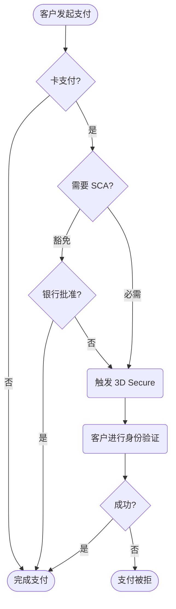

**强客户认证（SCA）** 是欧洲法规，于 2019 年 9 月 14 日生效，作为 **PSD2** 指令的一部分。它要求改变欧洲客户在线卡支付的认证方式。

要符合 SCA 要求，必须在卡交易中使用 :prose-annotation[3D Secure]{annotation="3D Secure (3DS) 为信用卡交易提供额外的身份验证层，保护商户免受欺诈性卡支付的责任。"}。银行可能会拒绝不遵循这些身份验证要求的支付。

支持 SCA 的步骤：

1. **确定 SCA 是否影响业务** - 查看 [下方要求](#哪些企业必须遵守-sca)
2. **选择符合 SCA 的产品** - 查看 [实施选项](#如何使用-onerway-产品实施-sca)
3. **更新集成** - 遵循集成指南以避免支付被拒

## 哪些企业必须遵守 SCA？

如果满足以下所有条件，请更新 Onerway 集成以支持 **SCA**：

- 位于 :prose-annotation[**欧洲经济区**]{annotation="欧洲经济区是具有劳动力、商品和资本自由流动的区域性单一市场。它包括欧盟成员国以及欧洲自由贸易联盟的三个额外国家。"} **（EEA）**
- 服务 **EEA** 客户
- 接受卡支付（信用卡或借记卡）

即使对于低风险交易，银行也可能要求身份验证。尽管某些交易可能根据欺诈率符合 :prose-annotation[SCA 豁免]{annotation="某些被认为低风险的交易（基于与支付提供商或银行相关的欺诈率量）可能免于欧洲强客户认证要求。"} 条件，但仍应更新集成以支持请求时的身份验证。

## 如何使用 Onerway 产品实施 SCA

无论是处理一次性支付还是保存卡信息供日后使用，Onerway 都提供预构建和可定制的产品来帮助满足 SCA 要求。

::warning
不符合 SCA 的集成（如使用托管收银台或旧版 JS SDK 的集成）可能会面临执行 SCA 的银行的高拒付率。
::

### 一次性支付

使用 [Payments API](#){badge="TODO"} 和 [Checkout](#){badge="TODO"} 接受卡支付。这两种产品都允许商户根据风险管理需求自定义 **3D Secure** 身份验证策略。

- **Checkout**：预构建的 Onerway 托管收银台流程，自动处理 SCA 要求。商户可以自定义 **3D Secure（3DS）** 策略。
- **Payments API**：允许商户自定义 SCA 身份验证并构建自定义支付流程，完全控制 **3DS** 策略。

### 支付身份验证流程

### 重复使用卡片

使用 [Payments API](#){badge="TODO"} 和 [Setup Intents API](#){badge="TODO"} 保存卡片供日后重复使用。也可以使用 **Checkout** 自动处理 SCA 要求，或使用 [Billing](#){badge="TODO"} 处理 :prose-annotation[订阅]{annotation="定期自动向客户收费的循环支付计划。"} 的 SCA。

::note
对于订阅支付，Onerway 在首次支付时强制执行 **3D Secure** 身份验证以确保符合 SCA 要求。后续的循环支付可以使用豁免。
::

## 自定义 3D Secure 集成

Onerway 支持为以下企业提供自定义 **3D Secure（3DS）** 集成：

- 具有完整风险控制能力
- 具有 **PCI DSS** 合规资质

使用自定义 **3DS**，可以：

- 自行集成 3DS 服务
- 通过 [API](#){badge="TODO"} 将身份验证结果传递给 Onerway
- 使用自己的风险评估完成交易

了解更多关于 [自定义 3DS 集成](#){badge="TODO"} 的信息。

## 相关资源

::docs-resources
  :::docs-resource-item{to="/developer-resources/authenticate-with-3d-secure" icon="i-lucide-shield-check" tags="API,安全"}
  :::
  :::docs-resource-item{to="/payments" icon="i-lucide-credit-card" tags="支付"}
  :::
::
