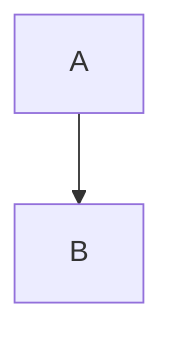
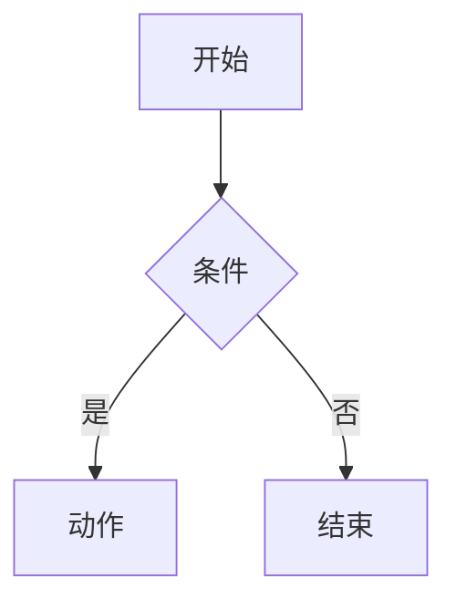
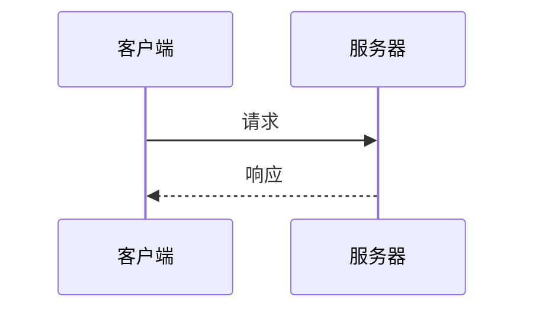
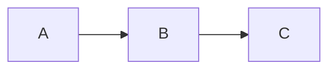

# ProseMermaid 设计文档

Mermaid 图表渲染组件，将 Markdown 中的 mermaid 代码块渲染为可交互的 SVG 图表。

---

## 实现状态

  **已完成** ✅

  **设计完成时间**：2025-12-30
  **实现完成时间**：2025-12-30
  **功能增强时间**：2025-01-04
  **测试状态**：已通过功能测试

---

## 组件概述

| 属性 | 值 |
|------|-----|
| 组件名 | `ProseMermaid` + `ProsePre` |
| 类型 | Prose（内容增强） |
| 来源 | 自研（客户端渲染方案） |
| 依赖 | `mermaid@11.x`、`panzoom`、`UIcon`、`UAlert`、`UModal`、`USkeleton`（Nuxt UI） |
| 配置文件 | `app/utils/mermaid.ts` |
| 调研文档 | `investigations/mermaid-integration-investigation.md` |

---

## 功能特性

  | 特性 | 说明 | 默认 |
  |------|------|------|
  | 🎨 主题适配 | 自动适配明暗主题 | ✅ |
  | 📱 响应式 | SVG 自适应容器宽度 | ✅ |
  | 🔍 拖拽缩放 | Alt + 拖拽平移，Alt + 滚轮缩放 | ✅ |
  | 🖥️ 全屏预览 | 点击按钮在弹窗中查看大图 | ✅ |
  | 📝 文字可选 | 默认可以选中图表中的文字 | ✅ |
  | 🖱️ 智能光标 | 按下 Alt 显示 grab，拖拽时显示 grabbing | ✅ |
  | 🎯 点状背景 | 美观的点状网格背景 | ✅ |
  | 💀 骨架屏加载 | 时序图风格的加载动画 | ✅ |
  | ⚠️ 错误处理 | 语法错误友好提示 | ✅ |
  | 🌐 国际化 | 完整 i18n 支持 | ✅ |
  | ♿ 可访问性 | ARIA 标签、键盘导航 | ✅ |

---

## API 设计

### ProseMermaid 组件

#### Props

| Prop | 类型 | 默认值 | 说明 |
|------|------|--------|------|
| `code` | `string` | **必填** | Mermaid 图表源代码 |
| `meta` | `string?` | - | 代码块元信息，支持配置选项 |

#### Meta 参数

通过 Markdown 代码块的 meta 字符串传递配置：

| 参数 | 类型 | 默认值 | 说明 |
|------|------|--------|------|
| `zoomable` | `"true" \| "false"` | `"true"` | 是否启用拖拽缩放和全屏预览 |
| `dottedBg` | `"true" \| "false"` | `"true"` | 是否显示点状背景 |

**使用示例**：

````markdown
<!-- 默认：启用缩放和点状背景 -->


<!-- 禁用缩放 -->


<!-- 禁用点状背景 -->


<!-- 同时禁用 -->

````

#### Slots

无

#### Events

组件不对外暴露事件。

---

### ProsePre 组件

#### Props

  | Prop | 类型 | 默认值 | 说明 |
  |------|------|--------|------|
  | `code` | `string?` | - | 代码内容 |
  | `language` | `string?` | - | 代码语言标识 |
  | `filename` | `string?` | - | 文件名 |
  | `highlights` | `number[]?` | - | 高亮行号 |
  | `hideHeader` | `boolean?` | `false` | 隐藏文件名头部 |
  | `meta` | `string?` | - | 元信息（传递给 ProseMermaid） |
  | `class` | `string?` | - | CSS 类名 |
  | `icon` | `string \| Record<string, unknown>?` | - | 自定义图标 |
  | `ui` | `object?` | - | UI 样式覆盖（root, header, filename, icon, copy, base） |

#### 功能

  - 检测 `language="mermaid"`，路由到 `ProseMermaid` 组件
  - 其他语言保持 Nuxt UI 完整功能（复制按钮、文件名、图标、行高亮等）
  - 覆盖 `@nuxt/ui` 默认组件，增强而非替代

---

## 文件结构

```
app/
├── components/content/
│   ├── ProseMermaid.vue  # Mermaid 渲染组件
│   └── ProsePre.vue      # 代码块包装组件（拦截 mermaid）
└── config/
    └── mermaid-themes.ts # Mermaid 主题配置

i18n/locales/
├── en.json               # 英文翻译（mermaid.*）
└── zh_cn.json            # 中文翻译（mermaid.*)

nuxt.config.ts            # 添加 'mermaid' 到 highlight.langs
package.json              # 添加 mermaid, panzoom 依赖
```

---

## 核心实现

### 技术选型

  **客户端渲染方案**（方案 A）

  **理由**：
  - ✅ 实现简单
  - ✅ 无需额外构建步骤
  - ✅ 主题切换支持良好
  - ✅ 符合 KISS 原则

### 渲染流程

```
Markdown: ```mermaid
    ↓
Nuxt Content (Shiki 高亮)
    ↓
<pre><code class="language-mermaid">...</code></pre>
    ↓
ProsePre 检测 language="mermaid"
    ↓
ProseMermaid 动态导入 mermaid.js
    ↓
客户端渲染为 SVG
    ↓
初始化 panzoom（如启用）
```

### 关键设计点

  | 设计点 | 实现方式 |
  |--------|----------|
  | 客户端渲染 | `import.meta.client` + 动态导入 |
  | 主题切换 | `useColorMode()` + watch 重新渲染 |
  | 主题配置 | `app/utils/mermaid.ts` 集中管理 |
  | 错误处理 | try-catch + UAlert 显示错误 |
  | Loading 状态 | `isLoading` ref + 骨架屏动画 |
  | 拖拽缩放 | `panzoom` 库 + Alt 键控制 |
  | 全屏预览 | `UModal` + 独立 panzoom 实例 |
  | 点状背景 | CSS `radial-gradient` + 明暗主题适配 |
  | 智能光标 | `cursorClass` computed + `isAltPressed`/`isDragging`/`isHovering` 状态 |
  | 样式方案 | Tailwind inline classes + 必要的全局 CSS |
  | 国际化 | `useI18n()` + 翻译键 `mermaid.*` |
  | 可访问性 | `role="img"` + `aria-label` + `role="status"` |

---

## 主题配置

### mermaid-themes.ts

集中管理 Mermaid 主题配置，支持明暗模式：

```typescript
// app/utils/mermaid.ts

// 明亮主题变量
const LIGHT_THEME_VARIABLES = {
  primaryColor: "#6366f1",
  primaryTextColor: "#1f2937",
  // ... 更多配置
};

// 暗色主题变量
const DARK_THEME_VARIABLES = {
  primaryColor: "#818cf8",
  primaryTextColor: "#f3f4f6",
  // ... 更多配置
};

// 导出配置获取函数
export const getMermaidConfig = (isDark: boolean) => ({
  startOnLoad: false,
  securityLevel: "strict",
  theme: "base",
  themeVariables: isDark ? DARK_THEME_VARIABLES : LIGHT_THEME_VARIABLES,
  themeCSS: isDark ? DARK_THEME_CSS : LIGHT_THEME_CSS,
  flowchart: {
    curve: "basis",
    padding: 20,
  },
});
```

### 自定义主题 CSS

通过 `themeCSS` 注入自定义样式到 SVG：

```css
/* 序列图参与者圆角 */
.actor {
  stroke-width: 1.5px;
  rx: 12px;
  ry: 12px;
}

/* 消息线条粗细 */
.messageLine0,
.messageLine1 {
  stroke-width: 1.5px;
}
```

---

## 交互设计

### 拖拽缩放

  | 操作 | 行为 |
  |------|------|
  | Alt + 拖拽 | 平移图表 |
  | Alt + 滚轮 | 缩放图表 |
  | 点击放大按钮 | 放大 1.5x |
  | 点击缩小按钮 | 缩小 0.67x |
  | 点击重置按钮 | 恢复原始位置和缩放 |
  | 点击全屏按钮 | 在弹窗中查看大图 |

### 光标状态

  | 状态 | 光标 |
  |------|------|
  | 默认 | `default`（可选中文字） |
  | Alt + 悬停 | `grab` |
  | Alt + 拖拽中 | `grabbing` |

---

## 状态管理

### 渲染状态

| 状态 | 说明 | UI 反馈 |
|------|------|---------|
| `isLoading` | 正在渲染图表 | 显示骨架屏 |
| `error` | 渲染失败 | 显示 UAlert 错误提示 |
| `svgContent` | 渲染成功 | 显示 SVG 图表 + 控制按钮 |

### 交互状态

| 状态 | 说明 |
|------|------|
| `isAltPressed` | Alt 键是否按下 |
| `isDragging` | 是否正在拖拽 |
| `isHovering` | 鼠标是否在图表上 |
| `isModalOpen` | 全屏弹窗是否打开 |

### 主题同步

- 监听 `colorMode.value` 变化
- 自动调用 `renderDiagram()` 重新渲染
- 配置来自 `mermaid-themes.ts`

---

## 使用示例

### 基础用法

````markdown

````

### 时序图

````markdown

````

### 禁用缩放

````markdown

````

### 禁用点状背景

````markdown

````

---

## 性能考虑

### 包体积

| 依赖 | 大小（gzip） |
|------|--------------|
| mermaid@11.x | ~100KB |
| panzoom | ~5KB |

### 优化策略

1. **动态导入**：使用 `await import()` 按需加载
2. **客户端限制**：`import.meta.client` 确保只在浏览器运行
3. **实例复用**：主图和弹窗使用独立 panzoom 实例，避免冲突
4. **清理机制**：`onUnmounted` 中销毁 panzoom 实例和事件监听

---

## 错误处理

### 渲染失败

```
Mermaid 语法错误
    ↓
catch 捕获异常
    ↓
显示 UAlert 错误提示（i18n）
    ↓
开发模式输出错误信息到控制台
```

### 库加载失败

```
import('mermaid') 失败
    ↓
catch 捕获异常
    ↓
显示 "Unknown error"（i18n）
```

---

## 样式集成

### Tailwind Inline Classes

主要样式使用 inline classes：
- `my-6` - 外层容器间距
- `flex items-center justify-center` - 居中布局
- `rounded-xl border-2 border-default` - 容器边框
- `overflow-hidden` / `overflow-x-auto` - 溢出处理

### 全局 CSS（必要场景）

```css
/* 点状背景 - Tailwind 无内置支持 */
figure.mermaid-dotted-bg {
  background-image: radial-gradient(
    circle,
    rgb(209 213 219 / 80%) 1px,
    transparent 1px
  );
  background-size: 16px 16px;
}
.dark figure.mermaid-dotted-bg {
  background-image: radial-gradient(
    circle,
    rgb(55 65 81 / 80%) 1px,
    transparent 1px
  );
}
```

**原因**：点状背景和 SVG 响应式无法通过 inline class 实现。

---

## 实现路线图

### 阶段 1：MVP ✅

  - [x] ProseMermaid 组件
  - [x] ProsePre 包装组件
  - [x] 客户端动态渲染
  - [x] 主题切换支持
  - [x] 错误处理

### 阶段 2：体验优化 ✅

  - [x] 骨架屏加载动画
  - [x] 自定义 Mermaid 主题变量（mermaid-themes.ts）
  - [x] 点状背景
  - [x] 国际化支持
  - [x] 可访问性增强
  - [ ] 懒加载优化（Intersection Observer）
  - [ ] SVG 缓存（避免重复渲染）

### 阶段 3：功能增强 ✅

  - [x] 全屏查看
  - [x] 拖拽平移
  - [x] 滚轮缩放
  - [x] 智能光标 UX
  - [x] Meta 参数配置（zoomable, dottedBg）
  - [ ] 源码查看 toggle
  - [ ] SVG/PNG 导出
  - [ ] 复制源码功能

### 阶段 4：性能升级（待定）

  - [ ] 升级到方案 B（rehype-mermaid）
  - [ ] 混合方案（开发用 A，生产用 B）
  - [ ] 构建时静态渲染

---

## 无障碍支持

### 当前支持

| 特性 | 状态 | 说明 |
|------|------|------|
| 语义化 HTML | ✅ | 使用 `<figure role="img">` 包裹 SVG |
| ARIA 标签 | ✅ | `aria-label="Mermaid diagram"` |
| 加载状态 | ✅ | `role="status"` |
| 按钮标签 | ✅ | 所有控制按钮有 `aria-label` |
| 键盘导航 | ✅ | 控制按钮可通过 Tab 访问 |
| 屏幕阅读器 | ✅ | 基础支持 |

### 待完善

- [ ] 提供纯文本描述作为降级方案
- [ ] 高对比度模式测试

---

## 国际化

### 翻译键

```json
{
  "mermaid": {
    "loading": "正在渲染图表...",
    "errorTitle": "图表渲染错误",
    "unknownError": "未知错误",
    "zoomIn": "放大",
    "zoomOut": "缩小",
    "reset": "重置视图",
    "fullscreen": "全屏查看",
    "fullscreenTitle": "图表预览",
    "zoomHint": "Alt + 拖拽平移 · Alt + 滚轮缩放"
  }
}
```

---

## 测试验证

### 功能测试 ✅

- [x] 流程图渲染
- [x] 时序图渲染
- [x] 类图渲染
- [x] Light 主题
- [x] Dark 主题
- [x] 主题切换
- [x] 语法错误处理
- [x] 拖拽平移
- [x] 滚轮缩放
- [x] 全屏预览
- [x] 点状背景
- [x] 禁用缩放 (zoomable="false")
- [x] 禁用背景 (dottedBg="false")

### 浏览器兼容性

- [x] Chrome（Latest）- 已验证
- [ ] Firefox（Latest）
- [ ] Safari（Latest）
- [ ] Edge（Latest）

### 性能测试

- [x] 单图渲染时间 < 500ms
- [x] 首屏加载增加 ~105KB
- [ ] 多图渲染性能（待测试）

---

## 参考文件

  | 文件 | 作用 |
  |------|------|
  | `app/components/content/ProseMermaid.vue` | Mermaid 渲染组件 |
  | `app/components/content/ProsePre.vue` | 代码块包装组件 |
  | `app/utils/mermaid.ts` | Mermaid 主题配置 |
  | `i18n/locales/en.json` | 英文翻译 |
  | `i18n/locales/zh_cn.json` | 中文翻译 |
  | `docs/investigations/mermaid-integration-investigation.md` | 技术调研 |
  | `docs/investigations/mermaid-styling-investigation.md` | 样式调研 |

---

## 升级建议

### 何时升级到方案 B

**时机**：
- 图表数量 > 20 个/页
- 首屏性能成为瓶颈
- SEO 成为硬性要求

**步骤**：
1. 安装 `rehype-mermaid`
2. 更新 `nuxt.config.ts` rehypePlugins 配置
3. 移除 `mermaid` 和 `panzoom` 依赖
4. 删除 `ProseMermaid.vue` 和 `ProsePre.vue`
5. 删除 `mermaid-themes.ts`
6. 测试构建输出

**兼容性**：
- ✅ Markdown 语法完全相同
- ✅ 无需修改现有文档

---

  *文档创建时间：2025-12-30*
  *最后更新时间：2025-01-04*
  *基于项目版本：Nuxt 4.2.1 + @nuxt/content 3.8.0 + Nuxt UI 4.1.0*
  *Mermaid 版本：11.12.2*
  *Panzoom 版本：9.4.3*
