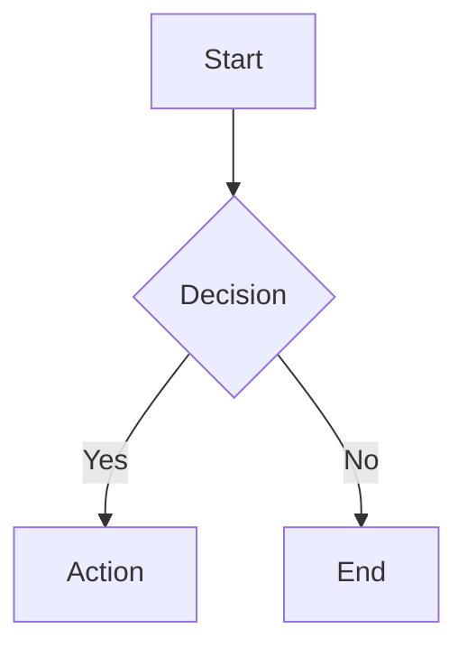
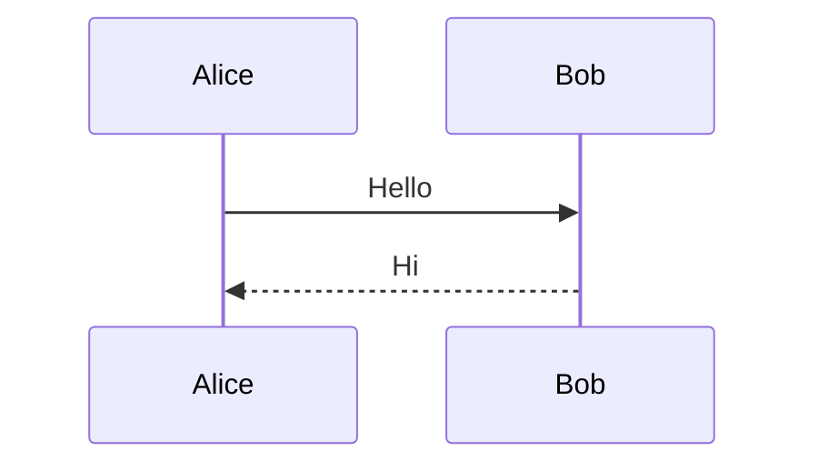
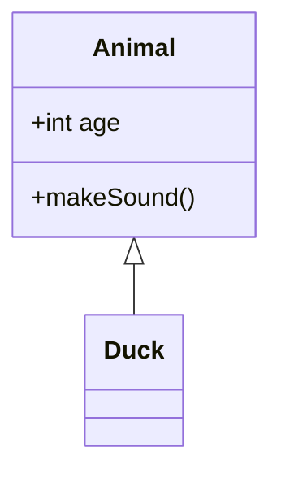

# Mermaid 图表集成调研

Nuxt Content 文档项目中集成 Mermaid 流程图、时序图等可视化图表的技术调研报告。

---

## 调研结论

**推荐方案**：方案 A - 客户端渲染方案（MVP）

**理由**：
- 实施快速（15-30 分钟）
- 符合 KISS 原则
- 后续可平滑升级

**设计文档**：`designs/ProseMermaid.md`

**后续升级路径**：方案 B（Rehype 插件）或混合方案

---

## 1. 背景与目标

### 1.1 需求背景

- **技术栈**：Nuxt 4.2.1 + @nuxt/content 3.8.0 + Nuxt UI 4.1.0
- **用户需求**：在文档中支持流程图、时序图、类图等可视化内容
- **目标用户**：文档编写者和阅读者
- **使用场景**：
  - API 调用流程图
  - 系统架构图
  - 状态机图
  - ER 图（实体关系图）
  - 时序图

### 1.2 功能目标

**MVP 阶段（方案 A）**：
1. ⏳ 支持标准 Markdown 代码块语法
2. ⏳ 渲染常见 Mermaid 图表类型
3. ⏳ 支持浅色/深色主题切换
4. ⏳ 与现有文档系统无缝集成
5. ⏳ 快速交付，最小化改动

**生产阶段（未来）**：
1. ⏳ 构建时静态渲染（提升性能）
2. ⏳ 导出功能（SVG/PNG）
3. ⏳ 源码查看/编辑
4. ⏳ 错误处理和降级方案

### 1.3 非功能目标

- **性能**：MVP 可接受轻微延迟，生产需优化
- **可维护性**：代码简洁，遵循项目规范
- **扩展性**：支持后续升级到更高级方案
- **兼容性**：支持主流浏览器

---

## 2. 项目现状分析

### 2.1 代码高亮配置

**当前配置**（`nuxt.config.ts`）：

```typescript
content: {
  build: {
    markdown: {
      highlight: {
        langs: [
          'bash', 'yaml', 'ts', 'typescript', 'diff', 'vue', 'json',
          'yml', 'css', 'mdc', 'md', 'js', 'javascript', 'jsx', 'tsx',
          'java', 'go', 'python', 'php', 'html', 'xml'
        ],
        theme: {
          default: "catppuccin-latte",
          dark: "dracula",
          light: "catppuccin-latte",
        },
      },
    },
  },
},
```

**发现**：
- ✅ 使用 Shiki 作为代码高亮引擎
- ✅ Shiki 已内置 mermaid 语言支持（`@shikijs/langs`）
- ❌ 当前配置中**未包含** `'mermaid'` 语言
- ✅ 支持 dark/light 主题切换

### 2.2 Markdown 插件配置

**当前配置**（`nuxt.config.ts`）：

```typescript
remarkPlugins: {
  "remark-emoji": {
    options: { emoticon: true }
  }
},
rehypePlugins: {},
```

**发现**：
- ✅ 已有 remark 插件配置示例
- ✅ `rehypePlugins` 为空，可用于扩展
- ✅ 与自定义模块（include、task-list）共存良好

### 2.3 现有 Prose 组件生态

**位置**：`app/components/content/`

**相关组件**：

| 组件 | 功能 | 参考价值 |
|------|------|----------|
| `ProsePre` | 代码块渲染（尚未自定义） | 需要覆盖以拦截 mermaid 块 |
| `ProseCode` | 内联代码增强 | 组件设计模式参考 |
| `ProseCodeCard` | 代码展示卡片 | 包装 mermaid 的潜在方案 |
| `ProseTabs` | 多标签页 | 主题切换、localStorage 参考 |
| `ProseAccordion` | 手风琴 | Nuxt UI 组件封装参考 |

**结论**：项目具备完整的 Prose 组件开发基础设施。

### 2.4 自定义模块架构

**现有模块**：

1. **`modules/include/`** - Markdown 引入系统
   - 使用 `content:file:beforeParse` hook
   - 支持 HMR 和依赖追踪
   - 处理自定义语法（`<!-- @include: path -->`）

2. **`modules/task-list/`** - 任务列表交互
   - 使用 `defineTransformer` 转换 minimark AST
   - 将 HTML 元素转换为 Vue 组件
   - 支持持久化和交互

**参考价值**：
- ✅ 成熟的模块开发模式
- ✅ AST 转换经验可复用
- ✅ 为方案 C（自定义模块）提供基础

### 2.5 主题切换机制

**实现方式**：`useColorMode()` composable

```typescript
const colorMode = useColorMode();
// colorMode.value: 'light' | 'dark'
```

**应用场景**：
- 代码高亮主题切换
- Nuxt UI 组件主题
- **可用于 Mermaid 主题切换**

---

## 3. Mermaid 技术背景

### 3.1 Mermaid 简介

**官方网站**：https://mermaid.js.org/

**核心特性**：
- 基于文本的图表定义
- 支持 10+ 种图表类型
- 主题可定制
- 活跃的社区支持

**常用图表类型**：

| 类型 | 语法 | 适用场景 |
|------|------|----------|
| 流程图 | `graph TD` | 业务流程、算法逻辑 |
| 时序图 | `sequenceDiagram` | API 交互、通信流程 |
| 类图 | `classDiagram` | 系统架构、数据模型 |
| 状态图 | `stateDiagram-v2` | 状态机、生命周期 |
| ER 图 | `erDiagram` | 数据库设计 |
| 甘特图 | `gantt` | 项目计划 |

### 3.2 Mermaid 渲染方式对比

#### 方式一：客户端渲染

**优点**：
- 实现简单
- 支持动态图表
- 主题可实时切换

**缺点**：
- 库体积大（~300KB）
- 首屏渲染慢
- 不利于 SEO

#### 方式二：构建时渲染

**优点**：
- 生成静态 SVG/PNG
- 首屏无延迟
- SEO 友好

**缺点**：
- 需要额外构建步骤
- 无法动态更新
- 需要 Puppeteer/Chromium

#### 方式三：混合渲染

- 开发环境：客户端渲染（快速反馈）
- 生产环境：构建时渲染（性能优化）

### 3.3 Mermaid 主题系统

**内置主题**：

| 主题名 | 适用场景 |
|--------|----------|
| `default` | 标准主题 |
| `forest` | 绿色调 |
| `dark` | 深色模式 |
| `neutral` | 中性色 |
| `base` | 基础主题（可定制） |

---

## 4. 技术方案对比

### 4.1 四种方案概览

| 方案 | 实现方式 | 复杂度 | 性能 | 适用阶段 |
|------|----------|--------|------|----------|
| **A: 客户端渲染** | ProseMermaid 组件 | 低 | 中 | **MVP** ✅ |
| B: Rehype 插件 | rehype-mermaid | 中 | 高 | 生产环境 |
| C: 自定义模块 | Nuxt Module + Transformer | 高 | 高 | 深度定制 |
| D: 混合方案 | 开发用 A，生产用 B | 中 | 高 | 最佳实践 |

### 4.2 方案 A：客户端渲染（推荐）

**架构设计**：

```
Markdown → Shiki 高亮 → <code class="language-mermaid">
    ↓
ProsePre 检测 language="mermaid"
    ↓
ProseMermaid 动态导入 mermaid.js
    ↓
客户端渲染为 SVG
```

**核心要点**：
- 动态导入确保只在客户端加载
- `useColorMode()` 实现主题自动切换
- 完整的错误处理和 loading 状态

**优缺点**：

✅ 实现简单（15-30 分钟）
✅ 主题切换自动
✅ 开发体验好
⚠️ 客户端体积增加 ~100KB
⚠️ SEO 不友好

### 4.3 方案 B：Rehype 插件

**架构设计**：

```
Markdown → rehype-mermaid 插件 → 构建时渲染 → 静态 SVG
```

**优缺点**：

✅ 性能最佳（构建时渲染）
✅ SEO 友好
⚠️ 构建时间增加
⚠️ 依赖 Puppeteer

### 4.4 方案 C：自定义模块

**架构设计**：

参考 `modules/task-list/`，创建 Nuxt Content Transformer。

**优缺点**：

✅ 完全自定义
✅ 深度集成
⚠️ 开发成本高（4-8 小时）
⚠️ 对简单需求过度设计

### 4.5 方案 D：混合方案

**策略**：
- 开发环境：客户端渲染（快速反馈）
- 生产环境：构建时渲染（性能优化）

**优缺点**：

✅ 兼顾开发和生产
⚠️ 配置复杂
⚠️ 需维护两套逻辑

### 4.6 方案对比总结

| 维度 | 方案 A | 方案 B | 方案 C | 方案 D |
|------|--------|--------|--------|--------|
| **实施时间** | 15-30 分钟 | 1-2 小时 | 4-8 小时 | 2-3 小时 |
| **首屏性能** | ⭐⭐⭐ | ⭐⭐⭐⭐⭐ | ⭐⭐⭐⭐⭐ | ⭐⭐⭐⭐⭐ |
| **开发体验** | ⭐⭐⭐⭐⭐ | ⭐⭐⭐ | ⭐⭐⭐⭐ | ⭐⭐⭐⭐⭐ |
| **SEO 友好** | ❌ | ✅ | ✅ | ✅ |
| **维护成本** | ⭐⭐⭐⭐⭐ | ⭐⭐⭐⭐ | ⭐⭐⭐ | ⭐⭐⭐⭐ |

---

## 5. 方案选择与建议

### 5.1 推荐方案

**方案 A**：客户端渲染方案（MVP）

**理由**：
1. ✅ 符合 KISS 原则（Keep It Simple, Stupid）
2. ✅ 快速交付，验证需求
3. ✅ 与现有组件模式一致
4. ✅ 后续可平滑升级到方案 B 或 D
5. ✅ 对现有代码影响最小

### 5.2 实施建议

**需要的文件**：
- `nuxt.config.ts` - 添加 'mermaid' 到 highlight.langs
- `app/components/content/ProseMermaid.vue` - Mermaid 渲染组件
- `app/components/content/ProsePre.vue` - 代码块包装组件
- `package.json` - 添加 mermaid 依赖

**关键技术点**：
1. 使用动态导入确保只在客户端加载 mermaid
2. 通过 `useColorMode()` 实现主题自动切换
3. 完整的错误处理和 loading 状态
4. 使用 Tailwind inline classes 代替 scoped CSS

**详细实现**：参见 `designs/ProseMermaid.md`

### 5.3 关键风险

| 风险 | 影响 | 缓解措施 |
|------|------|----------|
| mermaid.js 体积大 (~100KB) | 首屏性能下降 | 懒加载、后续升级到方案 B |
| 渲染失败 | 用户看不到图表 | 完善错误处理和降级方案 |
| 复杂图表渲染慢 | 用户体验差 | 添加 loading 状态 |

---

## 6. 后续升级路径

### 6.1 从方案 A 到方案 B

**时机**：
- 图表数量增多（> 20 个）
- 首屏性能成为瓶颈
- SEO 成为硬性要求

**步骤**：
1. 安装 `rehype-mermaid`
2. 更新 `nuxt.config.ts` 配置
3. 移除客户端 mermaid.js 依赖
4. 测试构建输出

**兼容性**：
- ✅ Markdown 语法完全相同
- ✅ 无需修改现有文档

### 6.2 从方案 A 到方案 D（混合）

**优势**：
- 开发环境保持快速反馈
- 生产环境获得最佳性能

**实现**：
```typescript
// nuxt.config.ts
const isDev = process.env.NODE_ENV === 'development';

export default defineNuxtConfig({
  content: {
    build: {
      markdown: {
        rehypePlugins: isDev ? {} : {
          'rehype-mermaid': {},
        },
      },
    },
  },
});
```

---

## 7. 参考资源

### 7.1 官方文档

- [Mermaid 官网](https://mermaid.js.org/)
- [Mermaid Live Editor](https://mermaid.live/) - 在线测试工具
- [Nuxt Content Highlighting](https://content.nuxt.com/get-started/configuration#highlight)
- [Shiki Languages](https://shiki.style/languages)

### 7.2 社区方案

- [rehype-mermaid](https://github.com/remcohaszing/rehype-mermaid) - Rehype 插件
- [mermaid-cli](https://github.com/mermaid-js/mermaid-cli) - 命令行工具

### 7.3 项目参考文件

| 文件 | 参考内容 |
|------|----------|
| `app/components/content/ProseTabs.vue` | 主题切换、状态管理 |
| `app/components/content/ProseCodeCard.vue` | 代码块包装组件设计 |
| `modules/task-list/` | 自定义模块开发模式 |
| `docs/investigations/task-list-investigation.md` | 调研报告格式参考 |

### 7.4 相关文档

- `app/components/README.md` - 组件开发规范
- `content/CLAUDE.md` - MDC 语法指南
- `docs/technical-references/nuxt-content-architecture.md` - 技术架构
- `docs/designs/ProseMermaid.md` - 设计文档

---

## 8. 附录

### 8.1 Mermaid 语法速查

#### 流程图



#### 时序图



#### 类图



### 8.2 常见问题

**Q: 为什么选择方案 A 而不是方案 B？**

A: 方案 A 实施快速，适合 MVP 验证。后续可无缝升级到方案 B。

**Q: 客户端渲染会影响性能吗？**

A: 会有一定影响（~100KB），但通过懒加载和缓存可以优化。对于文档站点可以接受。

**Q: 如何自定义 Mermaid 主题？**

A: 在 `ProseMermaid.vue` 中修改 `mermaidConfig`，设置 `themeVariables`。详见设计文档。

**Q: 是否支持所有 Mermaid 图表类型？**

A: 是的，mermaid.js 支持的所有类型都可以使用。

---

*调研完成时间：2025-12-30*
*基于项目版本：Nuxt 4.2.1 + @nuxt/content 3.8.0*
*Mermaid 版本：11.x*
*实施状态：待实施*
