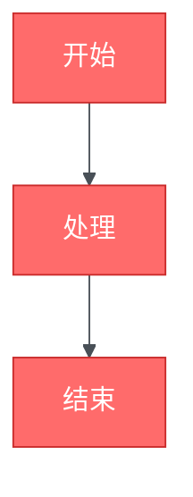

# Mermaid 图表样式自定义调研

Mermaid 图表的深度样式定制调研报告,涵盖主题系统、颜色变量、字体配置、CSS 注入等高级定制方法。

---

## 调研结论

  **推荐方案**：themeVariables 配置方案

  **理由**：
  - 类型安全,与 TypeScript 良好集成
  - 覆盖大部分样式定制需求
  - 自动处理颜色衍生和主题一致性
  - 无需处理 Shadow DOM 限制

  **高级需求**：结合 themeCSS 注入自定义 CSS

  **适用场景**：当 themeVariables 无法满足特殊样式需求时

---

## 1. 背景与目标

### 1.1 需求背景

- **当前状态**：已实现基础 Mermaid 集成(参见 `mermaid-integration-investigation.md`)
- **新需求**：需要自定义图表样式以匹配品牌风格
- **目标用户**：文档维护者和主题开发者
- **应用场景**：
  - 品牌色彩系统应用
  - 深色/浅色主题优化
  - 特定图表类型的视觉增强
  - 无障碍性改进(对比度、字体大小)

### 1.2 功能目标

**基础需求**：
1. ✅ 自定义主色调和配色方案
2. ✅ 调整字体和字号
3. ✅ 配置边框和背景色
4. ✅ 支持深色/浅色主题

**高级需求**：
1. ⏳ 针对特定图表类型的样式定制
2. ⏳ 注入自定义 CSS 实现复杂效果
3. ⏳ 动画和交互效果
4. ⏳ 响应式样式调整

### 1.3 技术约束

- **颜色格式**：仅支持 HEX 格式(如 `#ff0000`),不支持颜色名称(如 `red`)
- **可定制主题**：只有 `base` 主题支持 themeVariables 定制
- **Shadow DOM**：Mermaid 使用 Shadow DOM,外部 CSS 无法直接影响图表
- **构建时限制**：客户端渲染方案下,样式配置需在运行时应用

---

## 2. 样式定制方法概览

### 2.1 四种定制方案对比

  | 方案 | 配置位置 | 灵活性 | 复杂度 | 适用场景 |
  |------|----------|--------|--------|----------|
  | **A: 内置主题** | `theme: 'default'\|'dark'\|'neutral'\|'forest'` | 低 | 极低 | 快速应用预设风格 |
  | **B: themeVariables** | `theme: 'base'` + `themeVariables: {...}` | 高 | 低 | 大部分定制需求 ✅ |
  | **C: themeCSS** | `themeCSS: "..."` | 极高 | 中 | 特殊样式需求 |
  | **D: %%init%% 指令** | Markdown frontmatter | 高 | 低 | 单个图表定制 |

### 2.2 方案选择指南

```
需要定制吗?
  ├─ 否 → 使用内置主题(方案 A)
  └─ 是 → 单个图表还是全局?
      ├─ 单个 → %%init%% 指令(方案 D)
      └─ 全局 → themeVariables 够用吗?
          ├─ 是 → themeVariables(方案 B) ✅
          └─ 否 → themeCSS(方案 C)
```

---

## 3. 方案详解

### 3.1 方案 A: 内置主题

**适用场景**：无需定制,直接使用预设风格。

#### 可用主题

| 主题名 | 特点 | 适用场景 |
|--------|------|----------|
| `default` | 标准配色,清晰易读 | 通用文档 |
| `neutral` | 黑白灰,无彩色 | 打印文档、正式报告 |
| `dark` | 深色背景,亮色元素 | 深色模式界面 |
| `forest` | 绿色调,自然风格 | 环保、自然主题 |
| `base` | 最小样式,用于定制 | **定制的基础** |

#### 配置方法

```typescript
// ProseMermaid.vue
const mermaidConfig = computed(() => ({
  theme: 'dark', // 或 'default', 'neutral', 'forest', 'base'
  // ...
}));
```

---

### 3.2 方案 B: themeVariables 定制 (推荐)

  **适用场景**：需要调整颜色、字体、间距等常见样式属性。

#### 核心概念

  1. **基础主题**：必须设置 `theme: 'base'`
  2. **变量覆盖**：通过 `themeVariables` 对象覆盖默认值
  3. **自动衍生**：系统自动计算相关颜色(如边框色、文本色)

#### 配置示例

```typescript
const mermaidConfig = computed(() => ({
  theme: 'base',
  themeVariables: {
    // 核心颜色
    primaryColor: '#BB2528',
    primaryTextColor: '#fff',
    primaryBorderColor: '#7C0000',

    // 辅助颜色
    secondaryColor: '#006100',
    tertiaryColor: '#fff',

    // 线条和连接
    lineColor: '#F8B229',

    // 字体
    fontFamily: 'Inter, -apple-system, sans-serif',
    fontSize: '16px',

    // 深色模式标志
    darkMode: colorMode.value === 'dark',

    // 背景
    background: colorMode.value === 'dark' ? '#1a1a1a' : '#ffffff',
  },
}));
```

#### 通用 themeVariables 完整列表

##### 核心变量

  | 变量名 | 类型 | 默认值 | 说明 |
  |--------|------|--------|------|
  | `darkMode` | boolean | `false` | 是否为深色模式,影响衍生颜色计算 |
  | `background` | hex | `#f4f4f4` | 图表背景色 |
  | `fontFamily` | string | `"trebuchet ms", verdana, arial, sans-serif` | 字体族 |
  | `fontSize` | string | `16px` | 基础字号 |

##### 主要颜色

  | 变量名 | 默认值 (浅色) | 说明 | 自动衍生 |
  |--------|---------------|------|----------|
  | `primaryColor` | `#fff4dd` | 主色 | → `primaryBorderColor` |
  | `primaryTextColor` | `#333` | 主文本色 | 深色模式自动调整为 `#eee` |
  | `primaryBorderColor` | 自动计算 | 主边框色 | 基于 `primaryColor` 衍生 |
  | `secondaryColor` | 自动计算 | 次要色 | 主色色相 -120° |
  | `secondaryBorderColor` | 自动计算 | 次要边框色 | 基于 `secondaryColor` |
  | `secondaryTextColor` | 自动计算 | 次要文本色 | - |
  | `tertiaryColor` | 自动计算 | 第三色 | 主色色相 +180°,亮度 +5 |
  | `tertiaryBorderColor` | 自动计算 | 第三边框色 | 基于 `tertiaryColor` |
  | `tertiaryTextColor` | 自动计算 | 第三文本色 | - |

##### 特殊元素

  | 变量名 | 默认值 | 说明 |
  |--------|--------|------|
  | `noteBkgColor` | `#fff5ad` | 注释背景色 |
  | `noteTextColor` | `#333` | 注释文本色 |
  | `noteBorderColor` | 自动计算 | 注释边框色 |
  | `lineColor` | `#333` | 连线颜色 |
  | `textColor` | `#333` | 通用文本色 |

---

#### 图表类型专用变量

##### Flowchart (流程图)

| 变量名 | 默认值 | 说明 |
|--------|--------|------|
| `nodeBkg` | = `primaryColor` | 节点背景色 |
| `mainBkg` | = `primaryColor` | 主要区域背景色 |
| `nodeBorder` | = `primaryBorderColor` | 节点边框色 |
| `nodeTextColor` | = `primaryTextColor` | 节点文本色 |
| `clusterBkg` | = `tertiaryColor` | 集群(子图)背景色 |
| `clusterBorder` | = `tertiaryBorderColor` | 集群边框色 |
| `titleColor` | = `tertiaryTextColor` | 标题颜色 |
| `edgeLabelBackground` | 自动计算 | 边标签背景色 |

**示例配置**：

```typescript
themeVariables: {
  theme: 'base',
  primaryColor: '#e3f2fd',     // 浅蓝背景
  primaryBorderColor: '#1976d2', // 蓝色边框
  nodeTextColor: '#0d47a1',    // 深蓝文字
  clusterBkg: '#fff3e0',       // 橙色集群背景
  lineColor: '#1976d2',        // 蓝色连线
}
```

##### Sequence Diagram (时序图)

| 变量名 | 默认值 | 说明 |
|--------|--------|------|
| `actorBkg` | `#ececff` | 参与者背景色 |
| `actorBorder` | 自动计算 | 参与者边框色 |
| `actorTextColor` | `#000` | 参与者文本色 |
| `actorLineColor` | `grey` | 参与者生命线颜色 |
| `signalColor` | `#333` | 信号线颜色 |
| `signalTextColor` | `#333` | 信号文本颜色 |
| `labelBoxBkgColor` | `#ececff` | 标签框背景色 |
| `labelBoxBorderColor` | 自动计算 | 标签框边框色 |
| `labelTextColor` | `#000` | 标签文本色 |
| `loopTextColor` | `#000` | 循环文本色 |
| `activationBorderColor` | `#666` | 激活框边框色 |
| `activationBkgColor` | `#f4f4f4` | 激活框背景色 |
| `sequenceNumberColor` | `#fff` | 序号颜色 |

**示例配置**：

```typescript
themeVariables: {
  theme: 'base',
  actorBkg: '#e8f5e9',         // 绿色参与者背景
  actorBorder: '#2e7d32',      // 深绿边框
  signalColor: '#1b5e20',      // 深绿信号线
  labelBoxBkgColor: '#fff9c4', // 黄色标签背景
  activationBkgColor: '#c8e6c9', // 浅绿激活框
}
```

##### Class Diagram (类图)

| 变量名 | 默认值 | 说明 |
|--------|--------|------|
| `classText` | `#131300` | 类名文本色 |
| `nodeBkg` | = `primaryColor` | 类框背景色 |
| `nodeBorder` | = `primaryBorderColor` | 类框边框色 |
| `mainBkg` | = `primaryColor` | 主背景色 |
| `lineColor` | 继承 | 关系线颜色 |

**示例配置**：

```typescript
themeVariables: {
  theme: 'base',
  primaryColor: '#f3e5f5',     // 紫色背景
  primaryBorderColor: '#7b1fa2', // 深紫边框
  classText: '#4a148c',        // 深紫文字
  lineColor: '#9c27b0',        // 紫色连线
}
```

##### State Diagram (状态图)

| 变量名 | 默认值 | 说明 |
|--------|--------|------|
| `stateBkg` | `#ececff` | 状态背景色 |
| `stateBorder` | 自动计算 | 状态边框色 |
| `stateLabelColor` | `#000` | 状态标签颜色 |
| `altBackground` | `#fff` | 备选背景色 |
| `errorBkgColor` | `#ff0000` | 错误状态背景色 |
| `errorTextColor` | `#fff` | 错误状态文本色 |

##### Gantt Chart (甘特图)

| 变量名 | 默认值 | 说明 |
|--------|--------|------|
| `taskBkgColor` | `#8a90dd` | 任务背景色 |
| `taskBorderColor` | `#534fbc` | 任务边框色 |
| `taskTextColor` | `#fff` | 任务文本色 |
| `activeTaskBkgColor` | `#bfc7ff` | 激活任务背景色 |
| `activeTaskBorderColor` | `#534fbc` | 激活任务边框色 |
| `doneTaskBkgColor` | `#d3d3d3` | 完成任务背景色 |
| `doneTaskBorderColor` | `#a9a9a9` | 完成任务边框色 |
| `critBkgColor` | `#ff0000` | 关键任务背景色 |
| `critBorderColor` | `#ff0000` | 关键任务边框色 |
| `todayLineColor` | `#ff0000` | 今日线颜色 |
| `gridColor` | `lightgrey` | 网格线颜色 |
| `sectionBkgColor` | `rgba(102, 102, 255, 0.49)` | 区段背景色 |

##### Pie Chart (饼图)

| 变量名 | 默认值 | 说明 |
|--------|--------|------|
| `pie1` ~ `pie12` | 自动生成 | 12 个扇区颜色 |
| `pieStrokeColor` | `#000` | 扇区边框色 |
| `pieStrokeWidth` | `2px` | 扇区边框宽度 |
| `pieOpacity` | `0.7` | 扇区不透明度 |
| `pieTitleTextSize` | `25px` | 标题字号 |
| `pieTitleTextColor` | = `primaryTextColor` | 标题颜色 |
| `pieSectionTextSize` | `17px` | 扇区标签字号 |
| `pieSectionTextColor` | = `primaryTextColor` | 扇区标签颜色 |
| `pieLegendTextSize` | `17px` | 图例字号 |
| `pieLegendTextColor` | = `primaryTextColor` | 图例颜色 |

**示例配置**：

```typescript
themeVariables: {
  theme: 'base',
  pie1: '#e74c3c',
  pie2: '#3498db',
  pie3: '#2ecc71',
  pie4: '#f39c12',
  pie5: '#9b59b6',
  pieStrokeWidth: '1px',
  pieOpacity: '0.8',
}
```

##### Git Graph (Git 图)

| 变量名 | 默认值 | 说明 |
|--------|--------|------|
| `git0` ~ `git7` | 自动生成 | 8 个分支颜色 |
| `gitBranchLabel0` ~ `gitBranchLabel7` | = `primaryTextColor` | 分支标签颜色 |
| `gitInv0` ~ `gitInv7` | 自动计算(反色) | 深色模式分支颜色 |

##### Requirement Diagram (需求图)

| 变量名 | 默认值 | 说明 |
|--------|--------|------|
| `requirementBackground` | `#ececff` | 需求框背景色 |
| `requirementBorderColor` | 自动计算 | 需求框边框色 |
| `requirementTextColor` | `#000` | 需求文本色 |
| `relationColor` | `#000` | 关系线颜色 |

##### Quadrant Chart (象限图)

| 变量名 | 默认值 | 说明 |
|--------|--------|------|
| `quadrant1Fill` | = `primaryColor` | 第一象限填充色 |
| `quadrant2Fill` | = `secondaryColor` | 第二象限填充色 |
| `quadrant3Fill` | = `tertiaryColor` | 第三象限填充色 |
| `quadrant4Fill` | 自动计算 | 第四象限填充色 |
| `quadrant1TextFill` | = `primaryTextColor` | 第一象限文本色 |
| `quadrant2TextFill` | = `secondaryTextColor` | 第二象限文本色 |
| `quadrant3TextFill` | = `tertiaryTextColor` | 第三象限文本色 |
| `quadrant4TextFill` | 自动计算 | 第四象限文本色 |

##### XY Chart (XY 图)

| 变量名 | 默认值 | 说明 |
|--------|--------|------|
| `xyChart.backgroundColor` | `transparent` | 图表背景色 |
| `xyChart.titleColor` | = `primaryTextColor` | 标题颜色 |
| `xyChart.xAxisTitleColor` | = `primaryTextColor` | X 轴标题颜色 |
| `xyChart.yAxisTitleColor` | = `primaryTextColor` | Y 轴标题颜色 |
| `xyChart.plotColorPalette` | `"#fff4dd, #ffd8a8, ..."` (12 colors) | 绘图色板(逗号分隔) |

---

#### 颜色自动衍生机制

  **原理**：为保证视觉一致性,Mermaid 会根据你设置的核心颜色自动计算相关颜色。

  **衍生规则**：

  1. **边框色**：通过 `mkBorder(color, darkMode)` 函数生成
      - 浅色模式：原色 darken 10%
      - 深色模式：原色 lighten 10%

  2. **辅助色**：
      - `secondaryColor`：主色色相 -120°(色轮旋转)
      - `tertiaryColor`：主色色相 +180°,亮度 +5

  3. **文本色**：
      - 根据背景亮度自动选择深色或浅色文本
      - `darkMode: true` 时,文本色自动变亮

  **示例**：

```typescript
// 只设置主色
themeVariables: {
  primaryColor: '#3498db', // 蓝色
  darkMode: false,
}

// 自动计算结果(近似)
// primaryBorderColor: '#2980b9' (深 10%)
// secondaryColor: '#34db9b' (色相 -120°, 绿色)
// tertiaryColor: '#db3498' (色相 +180°, 粉色)
```

  **最佳实践**：

  - ✅ 优先设置核心颜色,让系统自动衍生
  - ✅ 只在需要时手动覆盖衍生颜色
  - ⚠️ 避免设置过多变量,保持配色一致性

---

### 3.3 方案 C: themeCSS 注入

**适用场景**：themeVariables 无法满足的复杂样式需求。

#### 功能特点

- 直接注入 CSS 代码到 SVG 的 `<style>` 标签
- 可使用任意 CSS 语法(伪类、动画、媒体查询等)
- 需要了解 Mermaid 生成的 DOM 结构

#### 配置方法

```typescript
const mermaidConfig = computed(() => ({
  theme: 'base',
  themeCSS: `
    /* 自定义节点样式 */
    .node rect {
      stroke-width: 3px !important;
      rx: 8px !important;
      ry: 8px !important;
    }

    /* 自定义文本样式 */
    .nodeLabel {
      font-weight: 600 !important;
      text-transform: uppercase;
    }

    /* 自定义连线样式 */
    .edgePath .path {
      stroke-dasharray: 5, 5 !important;
      animation: dash 1s linear infinite;
    }

    /* 动画效果 */
    @keyframes dash {
      to {
        stroke-dashoffset: -10;
      }
    }

    /* 悬停效果 */
    .node:hover rect {
      filter: brightness(1.1);
    }
  `,
}));
```

#### 常用 CSS 类名

**Flowchart**：
- `.node` - 节点容器
- `.nodeLabel` - 节点文本
- `.cluster` - 子图/集群
- `.edgePath` - 边/连线
- `.edgeLabel` - 边标签

**Sequence Diagram**：
- `.actor` - 参与者
- `.activation` - 激活框
- `.messageLine0, .messageLine1` - 消息线
- `.labelBox` - 标签框
- `.loopLine` - 循环框线条
- `.noteText` - 注释文本

**Class Diagram**：
- `.classGroup` - 类容器
- `.classTitle` - 类名
- `.classMethod` - 方法
- `.classAttribute` - 属性
- `.relation` - 关系线

#### 注意事项

- ⚠️ 需要使用 `!important` 覆盖默认样式
- ⚠️ CSS 注入到 SVG `<style>`,不受外部样式表影响
- ⚠️ 复杂选择器可能失效,建议使用简单选择器
- ⚠️ 不同 Mermaid 版本 DOM 结构可能变化

---

### 3.4 方案 D: %%init%% 指令

  **适用场景**：为单个图表定制样式,不影响全局配置。

#### 语法格式

  在 Mermaid 代码块开头使用 `%%init%%` 指令：

```markdown

```

#### 多配置组合

```markdown
```mermaid
  %%{init: {
    'theme': 'base',
    'themeVariables': {...},
    'themeCSS': '...',
    'logLevel': 'debug',
    'securityLevel': 'loose'
  }}%%
  sequenceDiagram
  ...
```
```

#### 优先级

```
%%init%% 指令 > 全局 mermaid.initialize() > 默认配置
```

---

## 4. 实际应用示例

### 4.1 品牌色彩系统集成

**场景**：将 Onerway 品牌色应用到 Mermaid 图表。

**假设品牌色**：
- 主色：`#0066FF` (蓝色)
- 辅色：`#00C896` (绿色)
- 警示色：`#FF6B35` (橙红)
- 中性色：`#2D3748` (深灰)

**配置实现**：

```typescript
// ProseMermaid.vue
const brandColors = {
  primary: '#0066FF',
  secondary: '#00C896',
  warning: '#FF6B35',
  neutral: '#2D3748',
};

const mermaidConfig = computed(() => ({
  theme: 'base',
  securityLevel: 'strict',
  fontFamily: 'Inter, -apple-system, BlinkMacSystemFont, sans-serif',
  themeVariables: {
    // 核心品牌色
    primaryColor: brandColors.primary,
    primaryTextColor: '#ffffff',
    primaryBorderColor: '#0052CC', // 主色深化 20%

    secondaryColor: brandColors.secondary,
    secondaryTextColor: '#ffffff',
    secondaryBorderColor: '#00A077',

    tertiaryColor: '#F7FAFC', // 浅灰背景
    tertiaryTextColor: brandColors.neutral,
    tertiaryBorderColor: '#E2E8F0',

    // 线条和文本
    lineColor: brandColors.neutral,
    textColor: brandColors.neutral,

    // 字体
    fontFamily: 'Inter, -apple-system, BlinkMacSystemFont, sans-serif',
    fontSize: '16px',

    // 深色模式
    darkMode: colorMode.value === 'dark',
    background: colorMode.value === 'dark' ? '#1A202C' : '#FFFFFF',

    // 特殊元素
    noteBkgColor: '#FFF5CC',
    noteTextColor: brandColors.neutral,

    // 错误/警示色
    errorBkgColor: brandColors.warning,
    errorTextColor: '#ffffff',
  },
}));
```

**效果**：
- 流程图节点使用品牌蓝色
- 子图/集群使用浅灰背景
- 连线使用深灰色
- 注释使用暖色背景

---

### 4.2 深色模式优化

  **场景**：为深色主题优化对比度和可读性。

  **配置实现**：

```typescript
const mermaidConfig = computed(() => {
  const isDark = colorMode.value === 'dark';

  return {
    theme: 'base',
    themeVariables: {
      darkMode: isDark,

      // 动态背景
      background: isDark ? '#0D1117' : '#FFFFFF',

      // 动态主色(深色模式使用更亮的颜色)
      primaryColor: isDark ? '#58A6FF' : '#0366D6',
      primaryTextColor: isDark ? '#C9D1D9' : '#24292F',
      primaryBorderColor: isDark ? '#388BFD' : '#0349B4',

      // 动态辅色
      secondaryColor: isDark ? '#56D364' : '#2DA44E',
      secondaryTextColor: isDark ? '#C9D1D9' : '#24292F',

      // 动态中性色
      tertiaryColor: isDark ? '#161B22' : '#F6F8FA',
      tertiaryTextColor: isDark ? '#8B949E' : '#57606A',
      tertiaryBorderColor: isDark ? '#30363D' : '#D0D7DE',

      // 动态线条
      lineColor: isDark ? '#8B949E' : '#57606A',
      textColor: isDark ? '#C9D1D9' : '#24292F',

      // 动态注释
      noteBkgColor: isDark ? '#6E4906' : '#FFF8C5',
      noteTextColor: isDark ? '#E3B341' : '#24292F',
      noteBorderColor: isDark ? '#BB8009' : '#D4A72C',
    },
  };
});
```

  **关键点**：
  - ✅ 深色模式使用更高亮度的颜色(提升对比度)
  - ✅ 背景色和文本色对比度 ≥ 7:1(WCAG AAA 标准)
  - ✅ 边框色保持可见性
  - ✅ 注释使用暖色调在深色背景上更醒目

---

### 4.3 特定图表类型定制

#### 示例 1: 时序图优化

**目标**：清晰展示 API 调用流程。

```typescript
themeVariables: {
  theme: 'base',

  // 参与者样式
  actorBkg: '#E3F2FD',        // 浅蓝背景
  actorBorder: '#1976D2',     // 蓝色边框
  actorTextColor: '#0D47A1',  // 深蓝文字
  actorLineColor: '#BBDEFB',  // 浅蓝生命线

  // 信号线
  signalColor: '#1565C0',     // 深蓝信号线
  signalTextColor: '#0D47A1', // 深蓝文字

  // 激活框
  activationBkgColor: '#BBDEFB', // 浅蓝激活框
  activationBorderColor: '#1976D2', // 蓝色边框

  // 标签框
  labelBoxBkgColor: '#FFF9C4', // 黄色标签背景
  labelBoxBorderColor: '#F57F17', // 深黄边框
  labelTextColor: '#F57F17',   // 深黄文字

  // 注释
  noteBkgColor: '#FFECB3',    // 浅黄注释背景
  noteTextColor: '#E65100',   // 深橙文字
  noteBorderColor: '#FF6F00', // 橙色边框
}
```

#### 示例 2: 流程图优化

**目标**：突出关键路径。

```typescript
themeVariables: {
  theme: 'base',

  // 主节点(关键路径)
  primaryColor: '#4CAF50',        // 绿色背景
  primaryBorderColor: '#2E7D32',  // 深绿边框
  nodeTextColor: '#FFFFFF',       // 白色文字

  // 子节点(分支路径)
  secondaryColor: '#FFF9C4',         // 浅黄背景
  secondaryBorderColor: '#F9A825',   // 黄色边框
  secondaryTextColor: '#F57F17',     // 深黄文字

  // 集群/子图
  clusterBkg: '#E8F5E9',          // 浅绿背景
  clusterBorder: '#66BB6A',       // 中绿边框

  // 连线
  lineColor: '#2E7D32',           // 深绿连线

  // 标题
  titleColor: '#1B5E20',          // 深绿标题
}
```

结合 `themeCSS` 添加虚线效果：

```typescript
themeCSS: `
  /* 分支路径使用虚线 */
  .edgePath.branch .path {
    stroke-dasharray: 5, 5;
  }

  /* 关键路径加粗 */
  .edgePath.critical .path {
    stroke-width: 3px;
  }
`
```

---

### 4.4 响应式样式

  **场景**：根据容器宽度调整字号和间距。

  **实现方案**：通过 `themeCSS` 使用 CSS 自定义属性。

```typescript
themeCSS: `
  /* 小屏幕 */
  @container (max-width: 640px) {
    svg {
      font-size: 12px !important;
    }

    .nodeLabel {
      padding: 8px !important;
    }
  }

  /* 中等屏幕 */
  @container (min-width: 641px) and (max-width: 1024px) {
    svg {
      font-size: 14px !important;
    }
  }

  /* 大屏幕 */
  @container (min-width: 1025px) {
    svg {
      font-size: 16px !important;
    }

    .nodeLabel {
      padding: 12px !important;
    }
  }
`
```

  **注意**：需要在父容器上设置 `container-type: inline-size`。

---

## 5. 最佳实践

### 5.1 样式配置原则

#### KISS 原则(Keep It Simple, Stupid)

```typescript
// ❌ 过度配置
themeVariables: {
  primaryColor: '#0066FF',
  primaryTextColor: '#ffffff',
  primaryBorderColor: '#0052CC',
  secondaryColor: '#00C896',
  secondaryTextColor: '#ffffff',
  secondaryBorderColor: '#00A077',
  tertiaryColor: '#F7FAFC',
  tertiaryTextColor: '#2D3748',
  tertiaryBorderColor: '#E2E8F0',
  // ... 20+ 个变量
}

// ✅ 最小化配置,利用自动衍生
themeVariables: {
  primaryColor: '#0066FF',
  primaryTextColor: '#ffffff',
  darkMode: colorMode.value === 'dark',
  fontFamily: 'Inter, sans-serif',
  // 其他颜色自动衍生
}
```

#### DRY 原则(Don't Repeat Yourself)

```typescript
// ✅ 抽取品牌色常量
const BRAND_COLORS = {
  primary: '#0066FF',
  secondary: '#00C896',
  neutral: '#2D3748',
} as const;

const mermaidConfig = computed(() => ({
  theme: 'base',
  themeVariables: {
    primaryColor: BRAND_COLORS.primary,
    secondaryColor: BRAND_COLORS.secondary,
    textColor: BRAND_COLORS.neutral,
    // ...
  },
}));
```

#### 关注点分离

```typescript
// ✅ 分离深色/浅色逻辑
const getLightThemeVariables = () => ({
  background: '#FFFFFF',
  primaryColor: '#0066FF',
  textColor: '#2D3748',
  // ...
});

const getDarkThemeVariables = () => ({
  background: '#0D1117',
  primaryColor: '#58A6FF',
  textColor: '#C9D1D9',
  // ...
});

const mermaidConfig = computed(() => ({
  theme: 'base',
  themeVariables: colorMode.value === 'dark'
    ? getDarkThemeVariables()
    : getLightThemeVariables(),
}));
```

---

### 5.2 颜色选择建议

#### 对比度要求(WCAG 标准)

  | 级别 | 对比度 | 适用场景 |
  |------|--------|----------|
  | **AA** | ≥ 4.5:1 (正文)、≥ 3:1 (大字) | 最低要求 |
  | **AAA** | ≥ 7:1 (正文)、≥ 4.5:1 (大字) | 增强无障碍 |

  **工具推荐**：
  - [WebAIM Contrast Checker](https://webaim.org/resources/contrastchecker/)
  - [Coolors Contrast Checker](https://coolors.co/contrast-checker)

#### 配色方案生成

  **工具推荐**：
  - [Adobe Color](https://color.adobe.com/) - 配色轮
  - [Coolors](https://coolors.co/) - 快速生成配色
  - [Paletton](https://paletton.com/) - 高级配色工具

  **配色策略**：

  1. **单色配色**：使用同一色相的不同明度
```typescript
primaryColor: '#0066FF',      // H: 210°
secondaryColor: '#0052CC',    // 深 20%
tertiaryColor: '#66A3FF',     // 浅 40%
```

  2. **互补色配色**：色轮上相对的颜色(180° 对角)
```typescript
primaryColor: '#0066FF',   // 蓝色 (H: 210°)
secondaryColor: '#FF6600', // 橙色 (H: 30°, 210-180=30)
```

  3. **三角配色**：色轮上等距 120° 的三个颜色
```typescript
primaryColor: '#0066FF',   // 蓝色 (H: 210°)
secondaryColor: '#FF0066', // 红色 (H: 330°, 210+120=330)
tertiaryColor: '#66FF00',  // 绿色 (H: 90°, 210-120=90)
```

---

### 5.3 性能优化

#### 避免不必要的重新渲染

```typescript
// ❌ 每次 render 都创建新对象,触发重新渲染
const mermaidConfig = () => ({
  theme: 'base',
  themeVariables: {
    primaryColor: '#0066FF',
    // ...
  },
});

// ✅ 使用 computed,只在依赖变化时重新计算
const mermaidConfig = computed(() => ({
  theme: 'base',
  themeVariables: {
    primaryColor: '#0066FF',
    darkMode: colorMode.value === 'dark', // 依赖项
    // ...
  },
}));
```

#### 减少 themeCSS 复杂度

```typescript
// ❌ 复杂选择器和大量 CSS
themeCSS: `
  .node:nth-child(odd) rect:not(.special):hover {
    filter: brightness(1.1) contrast(1.2) saturate(1.1);
    transition: all 0.3s ease-in-out;
  }
  /* ... 100+ 行 CSS */
`

// ✅ 简单选择器,必要样式
themeCSS: `
  .node rect {
    rx: 8px;
  }
  .nodeLabel {
    font-weight: 600;
  }
`
```

---

### 5.4 维护性建议

#### 版本控制

```typescript
// app/utils/mermaid.ts
export const MERMAID_THEME_VERSION = '1.0.0';

export const LIGHT_THEME = {
  version: MERMAID_THEME_VERSION,
  theme: 'base',
  themeVariables: {
    // ...
  },
} as const;

export const DARK_THEME = {
  version: MERMAID_THEME_VERSION,
  theme: 'base',
  themeVariables: {
    // ...
  },
} as const;
```

#### 文档化

```typescript
/**
 * Mermaid 图表主题配置
 *
 * @see https://mermaid.js.org/config/theming.html
 * @see docs/investigations/mermaid-styling-investigation.md
 *
 * @example
 * // 使用预设主题
 * const config = useMermaidTheme('light');
 *
 * @example
 * // 自定义主题
 * const config = useMermaidTheme('custom', {
 *   primaryColor: '#FF6B6B',
 * });
 */
export const useMermaidTheme = (
  mode: 'light' | 'dark' | 'custom',
  overrides?: Partial<MermaidThemeVariables>
) => {
  // ...
};
```

#### 单元测试

```typescript
// mermaid-theme.spec.ts
import { describe, it, expect } from 'vitest';
import { getLightTheme, getDarkTheme } from '@/utils/mermaid';

describe('Mermaid Themes', () => {
  it('should have valid hex colors', () => {
    const theme = getLightTheme();
    expect(theme.themeVariables.primaryColor).toMatch(/^#[0-9A-F]{6}$/i);
  });

  it('should set darkMode flag correctly', () => {
    const lightTheme = getLightTheme();
    const darkTheme = getDarkTheme();

    expect(lightTheme.themeVariables.darkMode).toBe(false);
    expect(darkTheme.themeVariables.darkMode).toBe(true);
  });

  it('should have sufficient contrast', () => {
    const theme = getLightTheme();
    const contrast = calculateContrast(
      theme.themeVariables.background,
      theme.themeVariables.textColor
    );

    expect(contrast).toBeGreaterThanOrEqual(4.5); // WCAG AA
  });
});
```

---

## 6. 项目集成方案

### 6.1 当前项目配置

**文件**：`app/components/content/ProseMermaid.vue`

**当前实现**：

```typescript
const mermaidConfig = computed(() => ({
  startOnLoad: false,
  theme: colorMode.value === 'dark' ? 'dark' : 'default',
  securityLevel: 'strict',
  fontFamily: 'inherit',
}));
```

**问题**：
- ❌ 使用内置主题,无法定制
- ❌ 颜色和品牌不一致
- ❌ 深色模式对比度不足

---

### 6.2 推荐升级方案

#### 方案一: 基础定制(最小改动)

  **目标**：保持简单,仅调整核心颜色和字体。

  **实现**：

```typescript
// app/components/content/ProseMermaid.vue
const mermaidConfig = computed(() => {
  const isDark = colorMode.value === 'dark';

  return {
    startOnLoad: false,
    theme: 'base', // 改用 base 主题
    securityLevel: 'strict',
    themeVariables: {
      // 深色模式标志
      darkMode: isDark,

      // 字体(继承 Nuxt UI)
      fontFamily: 'inherit',
      fontSize: '16px',

      // 简单配色(利用自动衍生)
      primaryColor: isDark ? '#58A6FF' : '#0366D6',
      primaryTextColor: isDark ? '#C9D1D9' : '#FFFFFF',

      // 背景
      background: isDark ? '#0D1117' : '#FFFFFF',

      // 线条和文本
      lineColor: isDark ? '#8B949E' : '#57606A',
      textColor: isDark ? '#C9D1D9' : '#24292F',
    },
  };
});
```

  **优点**：
  - ✅ 改动最小(10 行代码)
  - ✅ 视觉效果立即改善
  - ✅ 保持向后兼容

---

#### 方案二: 品牌定制(推荐)

**目标**：与 Onerway 品牌色系统集成。

**步骤 1**：创建主题配置文件

```typescript
// app/utils/mermaid.ts
import type { MermaidConfig } from 'mermaid';

/** Onerway 品牌色 */
export const BRAND_COLORS = {
  primary: '#0066FF',
  secondary: '#00C896',
  warning: '#FF6B35',
  neutral: '#2D3748',
} as const;

/** 浅色主题 */
export const getLightThemeVariables = () => ({
  darkMode: false,

  // 核心颜色
  primaryColor: '#E3F2FD',
  primaryTextColor: BRAND_COLORS.primary,
  primaryBorderColor: BRAND_COLORS.primary,

  secondaryColor: '#E0F2F1',
  secondaryTextColor: BRAND_COLORS.secondary,
  secondaryBorderColor: BRAND_COLORS.secondary,

  tertiaryColor: '#F5F5F5',
  tertiaryTextColor: BRAND_COLORS.neutral,
  tertiaryBorderColor: '#E0E0E0',

  // 背景和线条
  background: '#FFFFFF',
  lineColor: BRAND_COLORS.neutral,
  textColor: BRAND_COLORS.neutral,

  // 字体
  fontFamily: 'inherit',
  fontSize: '16px',

  // 注释
  noteBkgColor: '#FFF9C4',
  noteTextColor: BRAND_COLORS.neutral,
  noteBorderColor: '#FFD54F',
});

/** 深色主题 */
export const getDarkThemeVariables = () => ({
  darkMode: true,

  // 核心颜色(使用更亮的色调)
  primaryColor: '#1E3A8A',
  primaryTextColor: '#93C5FD',
  primaryBorderColor: '#3B82F6',

  secondaryColor: '#064E3B',
  secondaryTextColor: '#6EE7B7',
  secondaryBorderColor: '#10B981',

  tertiaryColor: '#1F2937',
  tertiaryTextColor: '#9CA3AF',
  tertiaryBorderColor: '#374151',

  // 背景和线条
  background: '#0D1117',
  lineColor: '#6B7280',
  textColor: '#E5E7EB',

  // 字体
  fontFamily: 'inherit',
  fontSize: '16px',

  // 注释
  noteBkgColor: '#78350F',
  noteTextColor: '#FCD34D',
  noteBorderColor: '#B45309',
});

/** 获取 Mermaid 配置 */
export const getMermaidConfig = (isDark: boolean): MermaidConfig => ({
  startOnLoad: false,
  theme: 'base',
  securityLevel: 'strict',
  themeVariables: isDark ? getDarkThemeVariables() : getLightThemeVariables(),
});
```

**步骤 2**：在组件中使用

```typescript
// app/components/content/ProseMermaid.vue
import { getMermaidConfig } from '@/utils/mermaid';

const colorMode = useColorMode();

const mermaidConfig = computed(() =>
  getMermaidConfig(colorMode.value === 'dark')
);
```

**优点**：
- ✅ 配置集中管理
- ✅ 类型安全
- ✅ 易于维护和测试
- ✅ 可复用于其他组件

---

#### 方案三: 高级定制(可选)

  **目标**：添加自定义 CSS,实现动画和特殊效果。

  **实现**：

```typescript
// app/utils/mermaid.ts
export const CUSTOM_CSS = `
  /* 圆角节点 */
  .node rect,
  .actor rect {
    rx: 8px !important;
    ry: 8px !important;
  }

  /* 加粗文本 */
  .nodeLabel,
  .actor .actor-man {
    font-weight: 600 !important;
  }

  /* 平滑过渡 */
  .node rect,
  .edgePath .path {
    transition: all 0.2s ease !important;
  }

  /* 悬停效果 */
  .node:hover rect {
    filter: brightness(1.05) !important;
  }

  /* 虚线样式 */
  .messageLine0 {
    stroke-dasharray: 5, 5 !important;
  }
`;

export const getMermaidConfig = (isDark: boolean): MermaidConfig => ({
  // ...
  themeVariables: { ... },
  themeCSS: CUSTOM_CSS, // 添加自定义 CSS
});
```

---

### 6.3 迁移检查清单

- [ ] 创建 `app/utils/mermaid.ts` 配置文件
- [ ] 定义 `BRAND_COLORS` 常量
- [ ] 实现 `getLightThemeVariables()` 函数
- [ ] 实现 `getDarkThemeVariables()` 函数
- [ ] 实现 `getMermaidConfig()` 函数
- [ ] 更新 `ProseMermaid.vue` 使用新配置
- [ ] 测试浅色主题渲染
- [ ] 测试深色主题渲染
- [ ] 测试主题切换
- [ ] 验证对比度(WCAG AA 标准)
- [ ] 添加单元测试(可选)
- [ ] 更新文档和示例

---

## 7. 故障排查

### 7.1 常见问题

#### 问题 1: 颜色不生效

  **症状**：设置了 `themeVariables`,但图表颜色没有变化。

  **原因**：
  1. ❌ 未使用 `base` 主题
  2. ❌ 颜色格式错误(使用了颜色名称而非 HEX)
  3. ❌ 变量名拼写错误

  **解决方案**：

```typescript
// ❌ 错误
{
  theme: 'default', // 应该用 'base'
  themeVariables: {
    primaryColor: 'blue', // 应该用 '#0000FF'
    primaryColour: '#0000FF', // 拼写错误(应该是 primaryColor)
  }
}

// ✅ 正确
{
  theme: 'base',
  themeVariables: {
    primaryColor: '#0000FF',
  }
}
```

---

#### 问题 2: themeCSS 不生效

**症状**：注入的 CSS 没有应用到图表。

**原因**：
1. ❌ 选择器不正确
2. ❌ 缺少 `!important`
3. ❌ CSS 语法错误

**解决方案**：

```typescript
// ❌ 错误
themeCSS: `
  .node { /* 选择器可能不正确 */
    fill: red; /* 缺少 !important */
  }
`

// ✅ 正确
themeCSS: `
  .node rect {
    fill: red !important;
  }
`
```

**调试技巧**：

1. 在浏览器中检查 SVG 的 `<style>` 标签:
```javascript
document.querySelector('svg style').textContent
```

2. 使用浏览器开发者工具查看实际应用的样式

3. 检查控制台是否有 CSS 语法错误

---

#### 问题 3: 深色模式颜色不理想

  **症状**：深色模式下颜色对比度不足或过于刺眼。

  **原因**：
  1. ❌ 直接使用浅色模式的颜色
  2. ❌ 未设置 `darkMode: true`
  3. ❌ 对比度不足

  **解决方案**：

```typescript
// ❌ 错误
themeVariables: {
  primaryColor: '#0066FF', // 在深色背景上过于刺眼
  textColor: '#333333',    // 在深色背景上看不见
}

// ✅ 正确
themeVariables: {
  darkMode: true, // 启用深色模式
  primaryColor: '#58A6FF', // 使用更亮的色调
  textColor: '#C9D1D9',    // 浅色文本
  background: '#0D1117',   // 深色背景
}
```

  **对比度检查**：

  使用在线工具验证对比度:
  - [WebAIM Contrast Checker](https://webaim.org/resources/contrastchecker/)
  - 输入背景色和文本色
  - 确保对比度 ≥ 4.5:1

---

#### 问题 4: 字体不生效

**症状**：设置了 `fontFamily`,但图表仍使用默认字体。

**原因**：
1. ❌ 字体未加载
2. ❌ 字体名称拼写错误
3. ❌ 缺少回退字体

**解决方案**：

```typescript
// ❌ 错误
themeVariables: {
  fontFamily: 'MyCustomFont', // 字体可能未加载,缺少回退
}

// ✅ 正确
themeVariables: {
  fontFamily: 'Inter, -apple-system, BlinkMacSystemFont, "Segoe UI", sans-serif',
  // 提供多个回退字体
}
```

**字体加载检查**：

```javascript
// 在浏览器控制台检查字体是否加载
document.fonts.check('16px Inter')
// 返回 true 表示字体已加载
```

---

#### 问题 5: 配置不同步

  **症状**：主题切换后,Mermaid 图表没有更新。

  **原因**：
  1. ❌ 未使用 `computed` 或 `watch`
  2. ❌ Mermaid 未重新初始化

  **解决方案**：

```typescript
// ✅ 正确实现
const mermaidConfig = computed(() => ({
  theme: 'base',
  themeVariables: {
    darkMode: colorMode.value === 'dark', // 响应式依赖
    // ...
  },
}));

// 监听主题变化,重新渲染
watch(() => colorMode.value, () => {
  renderDiagram();
});
```

---

### 7.2 调试技巧

#### 查看实际配置

```typescript
// 在渲染前打印配置
console.log('Mermaid Config:', JSON.stringify(mermaidConfig.value, null, 2));
```

#### 查看生成的 SVG

```typescript
// 渲染后查看 SVG 内容
console.log('Generated SVG:', svgContent.value);
```

#### 使用 Mermaid Live Editor

1. 访问 [Mermaid Live Editor](https://mermaid.live/)
2. 粘贴你的 Mermaid 代码
3. 在 "Configuration" 标签中测试配置
4. 验证样式效果

---

## 8. 参考资源

### 8.1 官方文档

  - [Mermaid Theme Configuration](https://mermaid.js.org/config/theming.html) - 官方主题配置文档
  - [Mermaid Config Schema](https://mermaid.js.org/config/schema-docs/config.html) - 完整配置选项
  - [Mermaid Live Editor](https://mermaid.live/) - 在线编辑器和测试工具
  - [Mermaid GitHub - theme-base.js](https://github.com/mermaid-js/mermaid/blob/develop/packages/mermaid/src/themes/theme-base.js) - 基础主题源码

### 8.2 社区资源

  - [Customising Mermaid diagram font and colors - DEV Community](https://dev.to/leonards/customising-mermaid-diagram-font-and-colors-4pm9) - 字体和颜色定制教程
  - [GitHub - Gordonby/MermaidTheming](https://github.com/Gordonby/MermaidTheming) - Mermaid 主题实验项目
  - [Custom-themed Mermaid diagrams in Eleventy](https://traveling-coderman.net/code/eleventy-mermaid/) - Eleventy 中的自定义主题案例

### 8.3 工具推荐

  **配色工具**：
  - [Adobe Color](https://color.adobe.com/) - 专业配色工具
  - [Coolors](https://coolors.co/) - 快速配色生成器
  - [Paletton](https://paletton.com/) - 高级配色系统

  **对比度检查**：
  - [WebAIM Contrast Checker](https://webaim.org/resources/contrastchecker/) - WCAG 对比度验证
  - [Coolors Contrast Checker](https://coolors.co/contrast-checker) - 快速对比度检查

  **开发工具**：
  - [Mermaid CLI](https://github.com/mermaid-js/mermaid-cli) - 命令行工具
  - [VS Code Mermaid Preview](https://marketplace.visualstudio.com/items?itemName=bierner.markdown-mermaid) - VS Code 预览插件

### 8.4 项目相关文档

  | 文档 | 内容 |
  |------|------|
  | `docs/investigations/mermaid-integration-investigation.md` | Mermaid 集成调研(基础) |
  | `docs/designs/ProseMermaid.md` | ProseMermaid 组件设计 |
  | `app/components/content/ProseMermaid.vue` | Mermaid 渲染组件实现 |
  | `content/en/5.developer-resources/2.mermaid-test.md` | Mermaid 测试文档(英文) |
  | `content/zh_cn/5.developer-resources/2.mermaid-test.md` | Mermaid 测试文档(中文) |

---

## 9. 附录

### 9.1 完整配置模板

```typescript
// app/utils/mermaid.ts
import type { MermaidConfig } from 'mermaid';

/** 完整的 themeVariables 类型定义 */
export interface MermaidThemeVariables {
  // 核心变量
  darkMode?: boolean;
  background?: string;
  fontFamily?: string;
  fontSize?: string;

  // 主要颜色
  primaryColor?: string;
  primaryTextColor?: string;
  primaryBorderColor?: string;
  secondaryColor?: string;
  secondaryTextColor?: string;
  secondaryBorderColor?: string;
  tertiaryColor?: string;
  tertiaryTextColor?: string;
  tertiaryBorderColor?: string;

  // 通用元素
  noteBkgColor?: string;
  noteTextColor?: string;
  noteBorderColor?: string;
  lineColor?: string;
  textColor?: string;

  // Flowchart
  nodeBkg?: string;
  mainBkg?: string;
  nodeBorder?: string;
  nodeTextColor?: string;
  clusterBkg?: string;
  clusterBorder?: string;
  titleColor?: string;
  edgeLabelBackground?: string;

  // Sequence Diagram
  actorBkg?: string;
  actorBorder?: string;
  actorTextColor?: string;
  actorLineColor?: string;
  signalColor?: string;
  signalTextColor?: string;
  labelBoxBkgColor?: string;
  labelBoxBorderColor?: string;
  labelTextColor?: string;
  loopTextColor?: string;
  activationBorderColor?: string;
  activationBkgColor?: string;
  sequenceNumberColor?: string;

  // Class Diagram
  classText?: string;

  // State Diagram
  stateBkg?: string;
  stateBorder?: string;
  stateLabelColor?: string;
  altBackground?: string;
  errorBkgColor?: string;
  errorTextColor?: string;

  // Gantt Chart
  taskBkgColor?: string;
  taskBorderColor?: string;
  taskTextColor?: string;
  activeTaskBkgColor?: string;
  activeTaskBorderColor?: string;
  doneTaskBkgColor?: string;
  doneTaskBorderColor?: string;
  critBkgColor?: string;
  critBorderColor?: string;
  todayLineColor?: string;
  gridColor?: string;
  sectionBkgColor?: string;

  // Pie Chart
  pie1?: string;
  pie2?: string;
  pie3?: string;
  pie4?: string;
  pie5?: string;
  pie6?: string;
  pie7?: string;
  pie8?: string;
  pie9?: string;
  pie10?: string;
  pie11?: string;
  pie12?: string;
  pieStrokeColor?: string;
  pieStrokeWidth?: string;
  pieOpacity?: string;
  pieTitleTextSize?: string;
  pieTitleTextColor?: string;
  pieSectionTextSize?: string;
  pieSectionTextColor?: string;
  pieLegendTextSize?: string;
  pieLegendTextColor?: string;

  // Git Graph
  git0?: string;
  git1?: string;
  git2?: string;
  git3?: string;
  git4?: string;
  git5?: string;
  git6?: string;
  git7?: string;
  gitBranchLabel0?: string;
  gitBranchLabel1?: string;
  gitBranchLabel2?: string;
  gitBranchLabel3?: string;
  gitBranchLabel4?: string;
  gitBranchLabel5?: string;
  gitBranchLabel6?: string;
  gitBranchLabel7?: string;
  gitInv0?: string;
  gitInv1?: string;
  gitInv2?: string;
  gitInv3?: string;
  gitInv4?: string;
  gitInv5?: string;
  gitInv6?: string;
  gitInv7?: string;

  // Requirement Diagram
  requirementBackground?: string;
  requirementBorderColor?: string;
  requirementTextColor?: string;
  relationColor?: string;

  // Quadrant Chart
  quadrant1Fill?: string;
  quadrant2Fill?: string;
  quadrant3Fill?: string;
  quadrant4Fill?: string;
  quadrant1TextFill?: string;
  quadrant2TextFill?: string;
  quadrant3TextFill?: string;
  quadrant4TextFill?: string;

  // XY Chart
  'xyChart.backgroundColor'?: string;
  'xyChart.titleColor'?: string;
  'xyChart.xAxisTitleColor'?: string;
  'xyChart.yAxisTitleColor'?: string;
  'xyChart.plotColorPalette'?: string;
}

/** 完整配置模板 */
export const FULL_CONFIG_TEMPLATE: MermaidConfig = {
  startOnLoad: false,
  theme: 'base',
  securityLevel: 'strict',
  logLevel: 'error',

  themeVariables: {
    darkMode: false,
    background: '#FFFFFF',
    fontFamily: 'Inter, -apple-system, BlinkMacSystemFont, "Segoe UI", sans-serif',
    fontSize: '16px',

    primaryColor: '#E3F2FD',
    primaryTextColor: '#1976D2',
    primaryBorderColor: '#1976D2',

    secondaryColor: '#E0F2F1',
    secondaryTextColor: '#00796B',
    secondaryBorderColor: '#00796B',

    tertiaryColor: '#F5F5F5',
    tertiaryTextColor: '#616161',
    tertiaryBorderColor: '#BDBDBD',

    noteBkgColor: '#FFF9C4',
    noteTextColor: '#F57F17',
    noteBorderColor: '#FBC02D',

    lineColor: '#616161',
    textColor: '#212121',
  },

  themeCSS: `
    /* 自定义样式 */
    .node rect {
      rx: 8px;
      ry: 8px;
    }
  `,
};
```

### 9.2 快速参考卡片

#### 必须设置的变量

| 变量 | 用途 | 示例 |
|------|------|------|
| `theme: 'base'` | 启用自定义 | `theme: 'base'` |
| `primaryColor` | 主色 | `'#0066FF'` |
| `darkMode` | 深色模式 | `colorMode.value === 'dark'` |

#### 推荐设置的变量

| 变量 | 用途 | 示例 |
|------|------|------|
| `fontFamily` | 字体 | `'Inter, sans-serif'` |
| `background` | 背景色 | `'#FFFFFF'` |
| `textColor` | 文本色 | `'#2D3748'` |
| `lineColor` | 线条色 | `'#718096'` |

#### 常用图表类型配置

| 图表类型 | 关键变量 |
|----------|----------|
| **Flowchart** | `nodeBkg`, `nodeBorder`, `clusterBkg`, `lineColor` |
| **Sequence** | `actorBkg`, `signalColor`, `activationBkgColor`, `labelBoxBkgColor` |
| **Class** | `classText`, `nodeBkg`, `nodeBorder` |
| **Gantt** | `taskBkgColor`, `activeTaskBkgColor`, `doneTaskBkgColor`, `critBkgColor` |
| **Pie** | `pie1`~`pie12`, `pieStrokeColor`, `pieOpacity` |

---

## 10. 版本历史

  | 版本 | 日期 | 变更内容 |
  |------|------|----------|
  | 1.0.0 | 2025-12-30 | 初始版本,完整调研报告 |

---

*调研完成时间：2025-12-30*
*基于 Mermaid 版本：11.x*
*项目版本：Nuxt 4.2.1 + @nuxt/content 3.8.0*
*调研人员：Claude (Sonnet 4.5)*
